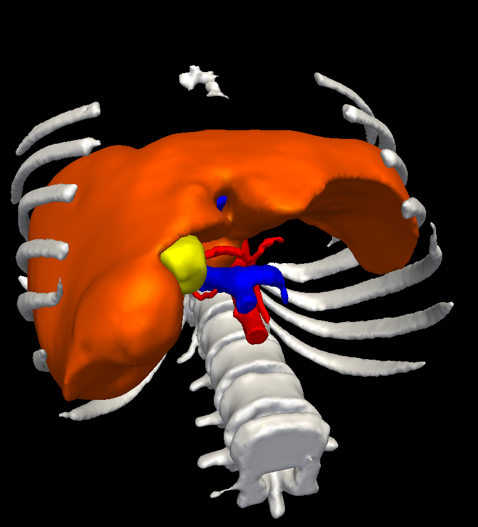
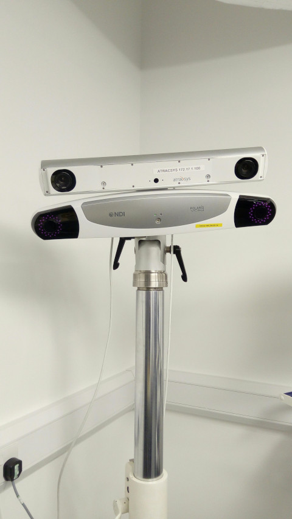
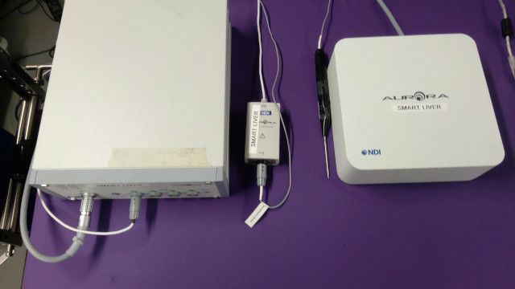
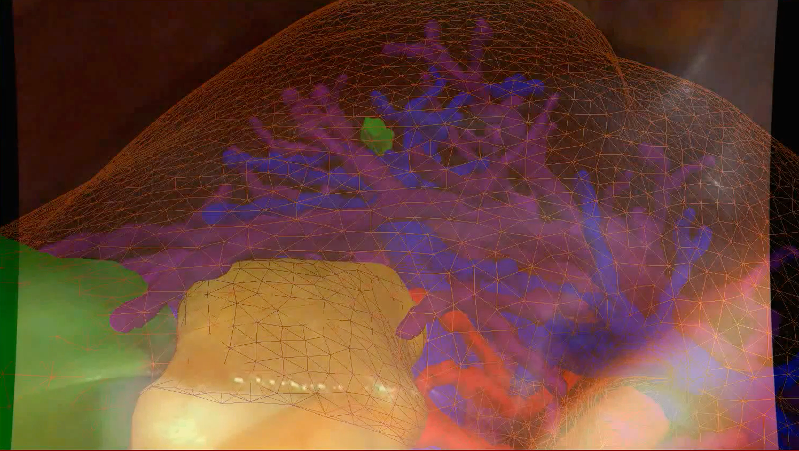
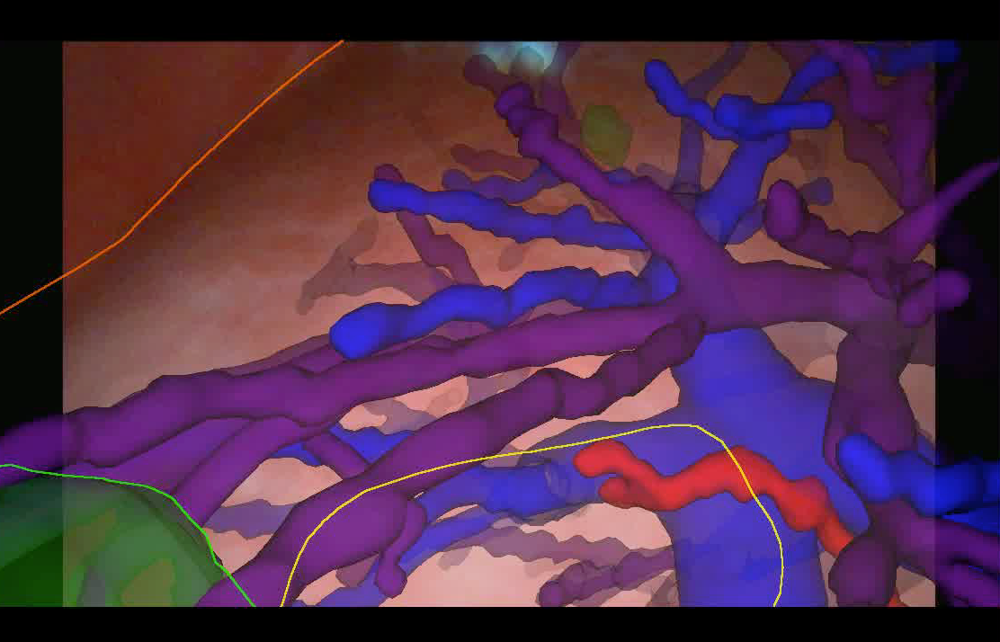
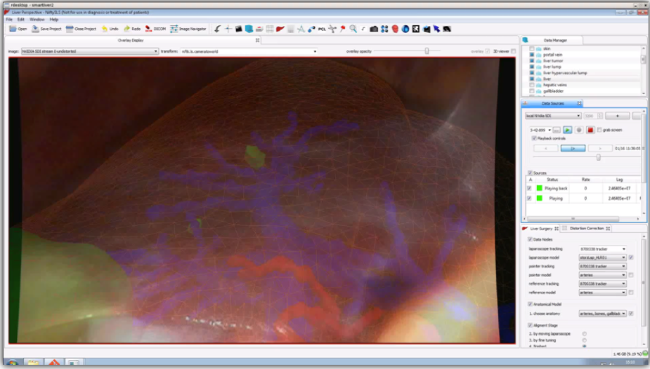
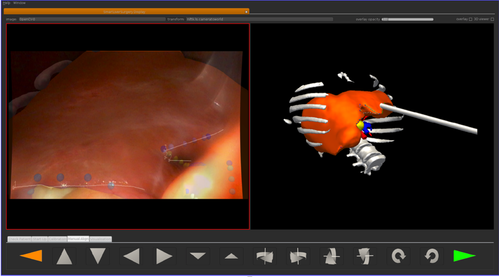

.. _Components:

System Components
=================

Learning Objectives
-------------------

Upon completion of this section, the student will be able to:

* Recall the main components
* Understand that the system performance is the sum of each part

Introduction
------------

As mentioned in papers like [PetersCleary2010]_, a CAS system normally comprises:

* Imaging
* Segmentation
* Tracking / Calibration
* Registration
* Visualisation
* User interface

Imaging
-------

This isn't a course in imaging. Common types include:

* Pre-op: MR, CT, PET, SPECT, DTI, DSA
* Intra-op: Video, Ultrasound, X-Ray (flouroscopy), PA

Segmentation
------------

  Data from CT scans can be converted to triangle meshes and rendered. This example produced by `Visible Patient <https://www.visiblepatient.com/en/>`_.

In this course we will cover:

* Segmentation methods, e.g. manual, automatic.
* Conversion to a mesh, smoothing, decimation.

Tracking / Calibration
----------------------

  Atracsys (top) and NDI Polaris Veiga (bottom) optical trackers.

  NDI Aurora Tracker: Left-to-right: System Control Unit, Sensor Interface Unit, Pointer, Field Generator.

In this course we will cover:

* Optical tracking
* Electro-magnetic (EM) tracking

Registration
------------

Registration is the process of aligning coordinate systems. In Medical Image Computing,
registration is normally between two 3D images, for example, registering an MR scan to a CT scan of
the same patient. However, in CAS systems, the challenge is often registering to the
physical space of the patient, which is constantly changing (e.g breathing), or deforming (soft tissues).

  Registration is aligning various images. Here a pre-operative model is aligned to intra-operative laparoscopic video, see [Thompson2015]_.

Visualisation
-------------

  Examples of Visualisations from the SmartLiver project. (top) Wireframe and too many meshes is confusing. (bottom) We experimented with depth fogging and outlines.

User Interface
--------------

  Examples of User Interfaces from the SmartLiver project. (top) Desktop application was not very suitable for the OR. (bottom) Complexity was reduced over time to improve usability, and to work on a touchscreen [Thompson2018]_.

Developing effective visualisations is an on-going area of research. It's not just a case of pretty graphics.
The challenge is to present the most useful information, at the correct point in a procedure, without distracting
the surgeon and causing attention blindness.

A System-Wide Approach
----------------------

So, the field of CAS is very diverse and multi-disciplinary.
To deploy a CAS system to the OR requires an understanding of all the components.

While an individual project, or research may choose to focus on one small component,
there must always be an eye on the bigger picture, to make sure the system is workable in practice.