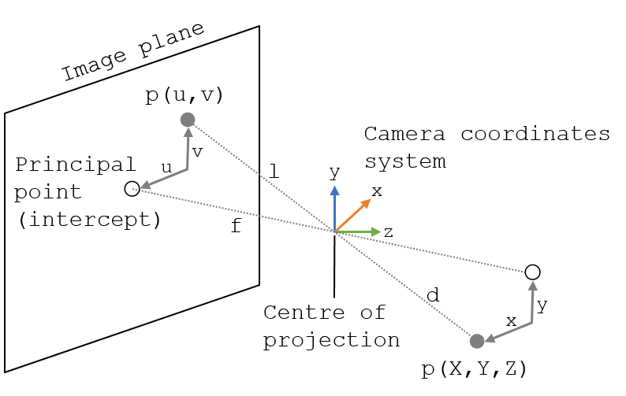

.. _Calibration:

Calibration
===========

Overview
--------

The process to find the geometrical relationship between a two coordinate systems (e.g, tracking system and the tip of a tracked tool) is called calibration. The calibration process provides a rigid (translation and rotation) or affine (scaling, rotation and translation) transformation relating the two coordinate systems. 
A good calibration process will depend on the instruments being tracked, the tracking system chosen and the accuracy needed for a specific clinical application.

Pivot calibration
-----------------

Pivot calibration is the transformation between a tracked marker/sensor and the tip of a tool (e.g., pointer). Pivot calibration consists in rotating the tracked instrument on a stationary point in order to localise the 3D position of the instrument's tip.
There are several ways to perform the pivot calibration, mainly: sphere fitting, algebraic one step, and algebraic two steps. All these methods solve exactly the same problem but taking the transformation in a different order. In the next section we describe the sphere fitting method.
  
Sphere fitting
^^^^^^^^^^^^^^

The sphere fitting method assumes that the tracked sensor/marker forms a sphere while is rotated (see figure below), where the marker is at the surface of the sphere and the tip of the tracked tool at the centre of the sphere (pivoting point).

.. figure:: pivot_calibration.png
  :alt: Transformations involved in a pivot calibration using an optical tracker
  :width: 600
  
  Transformations involved in a pivot calibration using an optical tracker

The equation of a sphere with origin at point :math:`(x_0, x_0, x_0)`, a point :math:`(x,y,z)` on the surface and a radius :math:`r` has the following equation:

.. math::

	(x - x_{0})^2 + (y - y_{0})^2 + (z-z_{0})^2 = r^2

If we expand this equation we get:

.. math::

	x^2 - 2xx + x_{0}^2 + y^2 - 2yy + y_{0}^2 + z^2 - 2zz + z_{0}^2 = r^2
	
which in turn is equivalent to:

.. math::

	x^2 + y^2 + z^2 = 2xx_{0} + 2yy_0 + 2zz_{0} - (x_{0})^2
	
Considering that we will have a list of :math:`n` surface points, this can be written in a least-squares form :math:`f=AC`:

Where 

.. math::
	f = \begin{pmatrix}
	x_{1}^2 + y_{1}^2 + z_{1}^2
	x_{2}^2 + y_{2}^2 + z_{2}^2
	...
	x_{n}^2 + y_{n}^2 + z_{n}^2
	\end{pmatrix}
	

This can be easily solved using Python (scipy.optimise.leastsq) or MATLAB functions among other libraries.

Hand-eye calibration
---------------------
Is the process of finding the transformation between the optical axis of the camera lens (camera intrinsic parameters and camera coordinate system) and the tracked marker/sensor.

.. figure:: handeye_calibration.png
  :alt: Pinhole model
  :width: 600
  
  Pinhole model

Free hand ultrasound calibration
^^^^^^^^^^^^^^^^^^^^^^^^^^^^^^^^
This procedure can also be used to perform a free hand ultrasound calibration, where we want to find the origin of the US image in respect to the tracked marker or sensor with high accuracy.
In order to achieve this, several calibration phantoms have been used (some of them are commercially available).

(see figure TBA)

Phantoms: Pointer stylus, single-wall, single line, lines in Z-configuration

Video camera intrinsic parameters calibration
---------------------------------------------
Intrinsic parameters refers to the mapping of camera coordinates and pixel coordinates and include: a scale factor (often equal to 1), focal length, principal point and geometric distortion.
Extrinsic camera parameters refers to the position and orientation of the camera with respect to the world coordinate system.

  
  Hand-eye calibration

Behnam Asadi provides a couple of videos explaining the intrinsic camera parameters for calibration (until min. 16.36):

.. raw:: html

    <iframe width="560" height="315" src="https://www.youtube.com/embed/oFZQykvEw14" frameborder="0" allow="accelerometer; autoplay; encrypted-media; gyroscope; picture-in-picture" allowfullscreen></iframe>

And a clear explanation on Zhang's method [Zhang2000]_, which is widely used:

.. raw:: html

    <iframe width="560" height="315" src="https://www.youtube.com/embed/hxbQ-F8u08U" frameborder="0" allow="accelerometer; autoplay; encrypted-media; gyroscope; picture-in-picture" allowfullscreen></iframe>

	

Errors
------
The calibration process needs to be accurate, robust and computationally efficient. However, this process introduces errors. 
