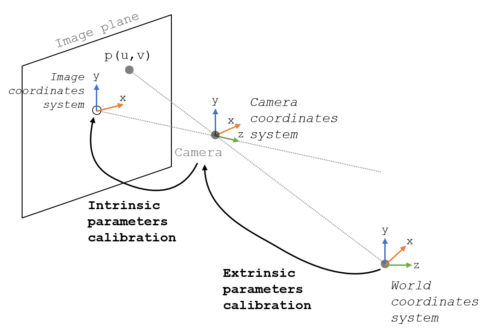

.. _Camera

Video camera parameters calibration
===================================

Video camera calibration can be divided in two different steps: intrinsic parameters calibration and extrinsic parameters calibration.
Extrinsic camera parameters refers to the position and orientation of the camera with respect to the world coordinate system.
Intrinsic camera parameters refers to the parameters needed to map camera coordinates to pixel coordinates.

The following image shows a representation of video calibration.

  
  Intrinsic versus extrinsic parameters

Intrinsic parameters include: 

- Scale factor (often equal to 1)
- Focal length (distance between the optical centre an the image plane)
- principal point (assume pixel 0,0 to be at the centre of the image)
- Skew (when the image plane is not exactly at the centre of the image plane)
- Geometric distortion.

Assuming the following pinhole camera model:

.. figure:: pinhole_model.png
  :alt: Pinhole model
  :width: 600
  
  Pinhole model

To map a 2D point *(u,v)* to a 3D point *(X,Y,Z)* the following equation need to be solved:

Where *s* is the scaling factor, *[R t]* the extrinsic camera parameters (*R* the rotation and *t* the translation of the camera to the world frame) and *K* corresponds to the intrinsic camera parameters, and is defined as follows:

Where *f* is the focal length, *m* the scaling factor in *x* and *y* (usually 1) and *(u,v)* the principal point.

The general idea to solve this equation is to take several images of a particular pattern (e.g., chessboard) from different positions and extract features from the images (e.g., corners or dots).
Then, the equation can be solved in order to find the camera parameters.

Behnam Asadi provides a couple of good videos explaining how to find the intrinsic camera parameters (until min. 16.36):

.. raw:: html

    <iframe width="560" height="315" src="https://www.youtube.com/embed/oFZQykvEw14" frameborder="0" allow="accelerometer; autoplay; encrypted-media; gyroscope; picture-in-picture" allowfullscreen></iframe>

And a clear explanation on Zhang's method [Zhang2000]_, which is the most widely used:

.. raw:: html

    <iframe width="560" height="315" src="https://www.youtube.com/embed/hxbQ-F8u08U" frameborder="0" allow="accelerometer; autoplay; encrypted-media; gyroscope; picture-in-picture" allowfullscreen></iframe>

	
