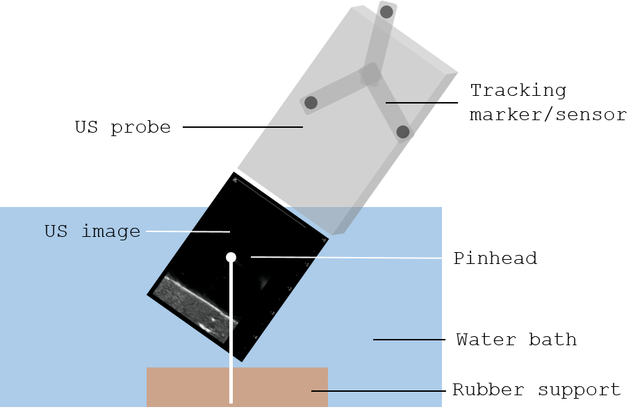
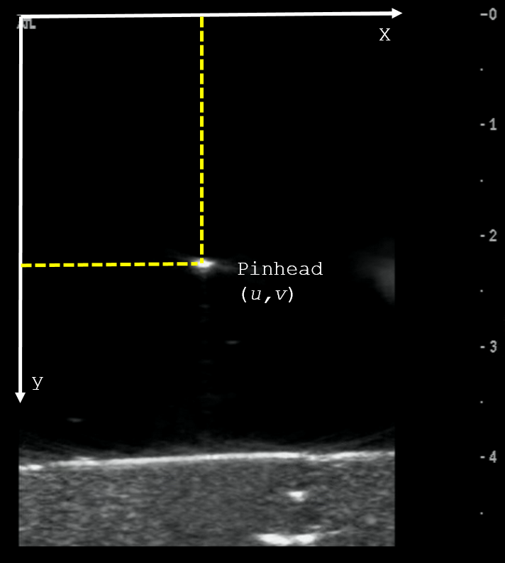

.. _Handeye:

Hand-eye calibration
====================

Hand-eye calibration is the process used to determine the transformation between a tracked sensor/marker and the camera coordinate system in order to position the camera in the 3D space of the tracking system.
The following figure shows a representation of the elements involved in a hand-eye calibration. 

.. figure:: handeye_calibration.png
  :alt: Hand-eye calibration
  :width: 600
  
  Hand-eye calibration
  
To find the geometrical relationship between the camera coordinate system and the tracking system, several images of a stationary feature (e.g., cross-hair, chessboard) from different points of view are acquired (or the other way round).
Then, to solve the calibration problem we have to solve the following equation: *AX=XB*. Where *A* and *B* represent transformations to the marker/sensor and is given by the tracking system (*[R1,T1]* and *[R2,T2]* in the above image). 
*X* is the unknown transformation matrix we need to find (*[R0,T0]* in the above image). 
There are several closed-form solutions to solve the equation such as [Thompson2016]_, [Malti2013]_, [Tsai1989]_ , [Heller2016]_, and [Morgan2017]_ among others.

In the following videos Dr. Clarkson explains and demonstrates how to do a hand-eye calibration with a laparoscope and a chessboard:

.. raw:: html

    <iframe width="560" height="315" src="https://www.youtube.com/embed/_hxFnr-0_0Y" frameborder="0" allow="accelerometer; autoplay; encrypted-media; gyroscope; picture-in-picture" allowfullscreen></iframe>

.. raw:: html

	<iframe width="560" height="315" src="https://www.youtube.com/embed/BTAFdsUyTfU" frameborder="0" allow="accelerometer; autoplay; encrypted-media; gyroscope; picture-in-picture" allowfullscreen></iframe>

Free-hand ultrasound calibration
--------------------------------
Hand-eye calibration can also be used to perform a free-hand ultrasound calibration, where we want to find the origin of the US image in respect to the tracked ultrasound probe with a marker/sensor attached.
The process is very similar. In this case we need a US-compatible phantom in which 2D points can be easily found on the 2D ultrasound images. 
There are several commercially available phantoms that can be used to perform this task, such as the `CIRS Brachytherapy QA phantom <https://www.cirsinc.com/products/ultrasound/zerdine-hydrogel/brachytherapy-qa-phantom/>`_.
This phantom contains several wires that are perpendicular to each other, therefore the crossing point can be used as a feature.
Alternatively, a water bath with a rubber support and a fixed steel pinhead can be used (see figure below).

  
  Image acquisition on a free hand ultrasound calibration

Then, in the same way we identified stationary features using a video image, here we find the coordinates of the pinhead on the ultrasound images, as shown below.

  
  Example of an ultrasound image showing the pinhead during the calibration process.

And the problem is solved as a least-squares minimisation. Examples: [Hu2016]_, [Mercier2005]_, [Lasso2014]_, among others. And a review: [Hsu2009]_.

Errors
------

The accuracy of this method depends on the tracking accuracy and the accuracy of the feature extraction from the images.