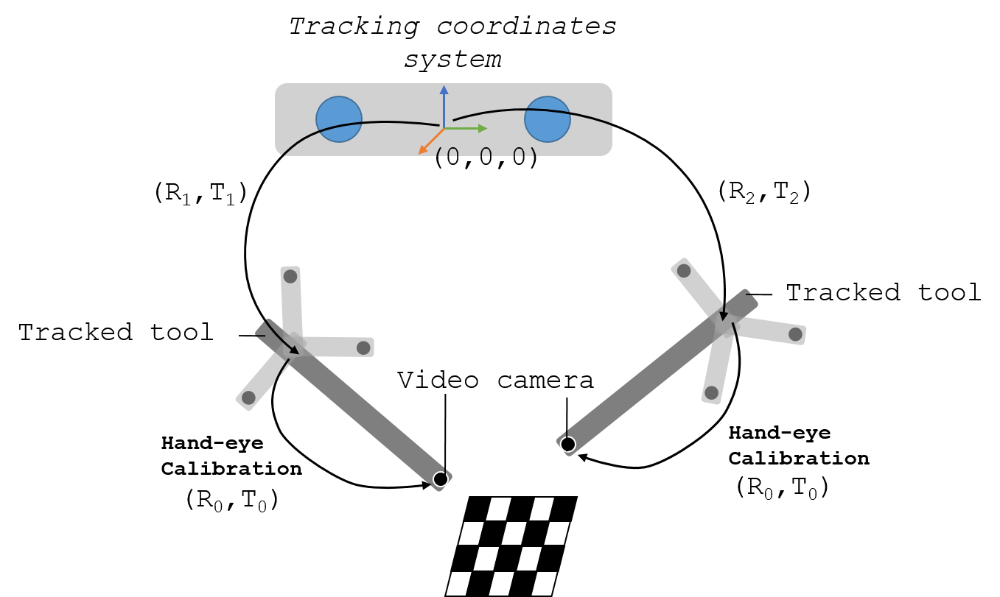

.. _Handeye:

Hand-eye calibration
====================

Hand-eye calibration is the process used to determine the transformation between a tracked sensor/marker and the camera coordinate system in order to position the camera in the 3D space of the tracking system.
The following figure shows a representation of the elements involved in a hand-eye calibration. 

  
  Hand-eye calibration
  
To find the geometrical relationship between the camera coordinate system and the tracking system, several images of a stationary feature (e.g., cross-hair, chessboard) from different points of view are acquired.
Then, to solve the calibration problem we have to solve the following equation: *AX=XB*. Where *A* and *B* represent transformations to the marker/sensor and is given by the tracking system (*[R1,T1]* and *[R2,T2]* in the above image). 
*X* is the unknown transformation matrix we need to find (*[R0,T0]* in the above image). 
There are several closed-form solutions to solve the equation as [REFS], among others.

Free hand ultrasound calibration
--------------------------------
Hand-eye calibration can also be used to perform a free-hand ultrasound calibration, where we want to find the origin of the US image in respect to the tracked ultrasound probe with a marker/sensor attached.
The process is very similar. In this case we need a US-compatible phantom in which points can be easily found.
There are several commercially available phantoms to perform this task: [LINK]

Then, in the same way we identified 

(see figure TBA)

Phantoms: Pointer stylus, single-wall, single line, lines in Z-configuration

Errors
------

The accuracy of this method depends on the tracking accuracy and the accuracy of the feature extraction from the images.