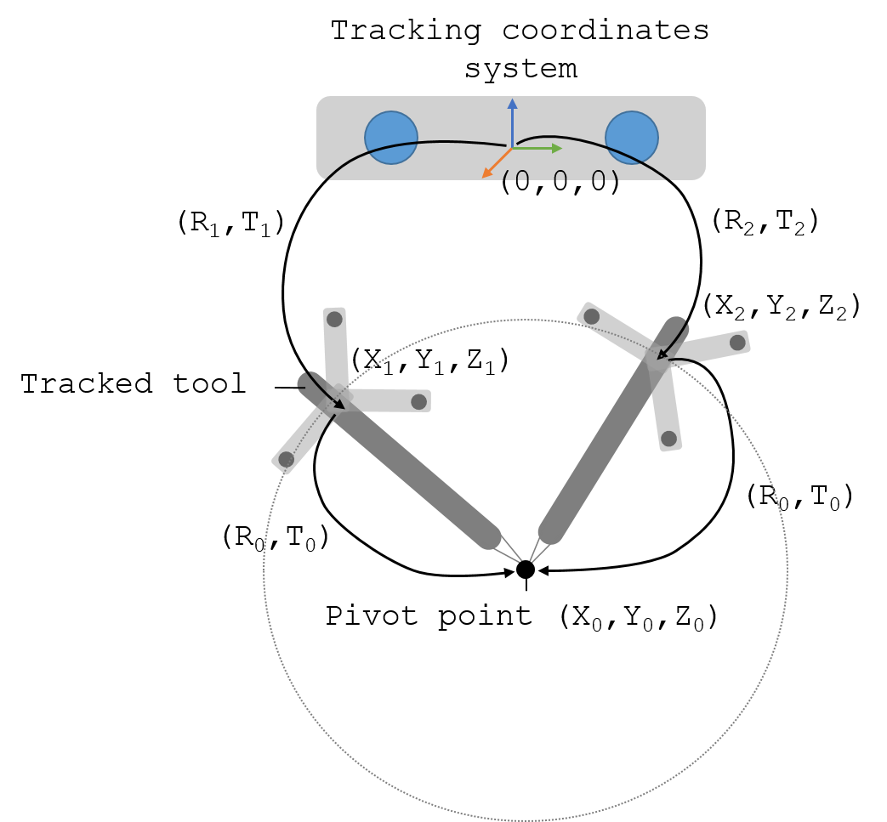

.. _Pivot:

Pivot calibration
=================

Pivot calibration is the transformation between a tracked marker/sensor and the tip of a tool (e.g., pointer). 
This process consists in rotating the tracked instrument on a stationary point in order to localise the 3D position of the instrument's tip.
There are several ways to perform the pivot calibration, mainly: sphere fitting, algebraic one step, and algebraic two steps. 
All these methods solve exactly the same problem but taking the transformation in a different order. 
A review can be found here: [Yaniv2015]_.

Sphere fitting
--------------

The sphere fitting method assumes that the tracked sensor/marker forms a sphere while is rotated (see figure below), where the marker is at the surface of the sphere and the tip of the tracked tool at the centre of the sphere (pivoting point).

  
  Transformations involved in a pivot calibration using an optical tracker

The equation of a sphere with origin at point *(x0, y0, z0)*, a point *(x,y,z)* on the surface and a radius *r* has the following equation:

If we expand this equation we get:

  
which in turn is equivalent to:

  
Considering that we will have a list of *n* surface points, this can be written in a least-squares form *f=AC*:

Where 

	

This can be easily solved using Python or MATLAB functions, among others libraries.

In the following video Dr. Clarkson explains and demonstrates how to do a pivot calibration:

.. raw:: html

    <iframe width="560" height="315" src="https://www.youtube.com/embed/wIEbG6ya63I" frameborder="0" allow="accelerometer; autoplay; encrypted-media; gyroscope; picture-in-picture" allowfullscreen></iframe>

Errors
------
The accuracy of this method depends on the shape of the tip of the tool, the length of the tool and the noise on the pivoting data.
When pivoting the tool on a stationary point on a flat surface, if the tip is not sharp enough(which very often is not sharp to avoid tissue damage) may lead to inaccuracies on the measurements.
One solutions is to use a soft surface to pivot the tool, however by doing that, the tip will be at the centre of the rotation instead of exactly at the tip.