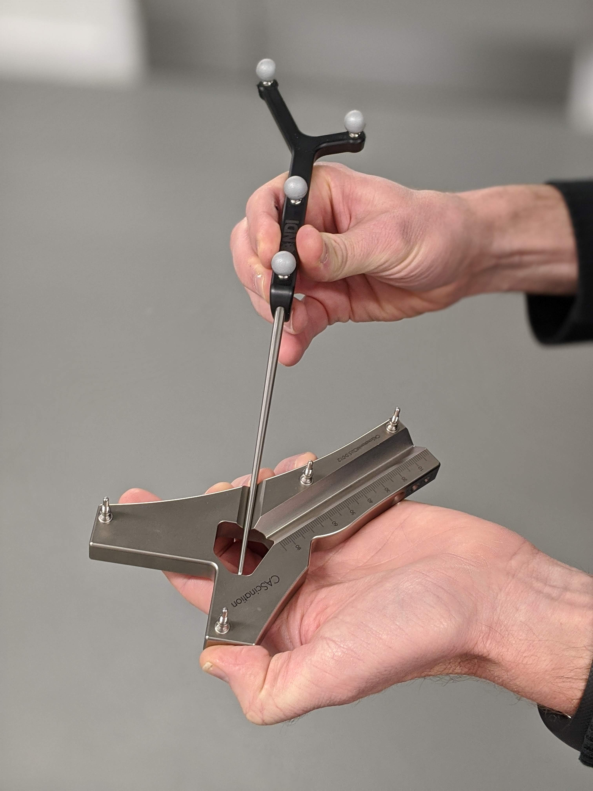
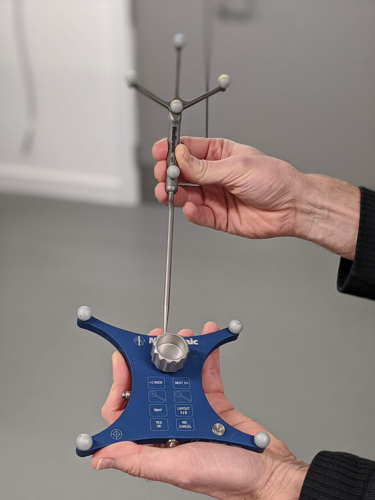
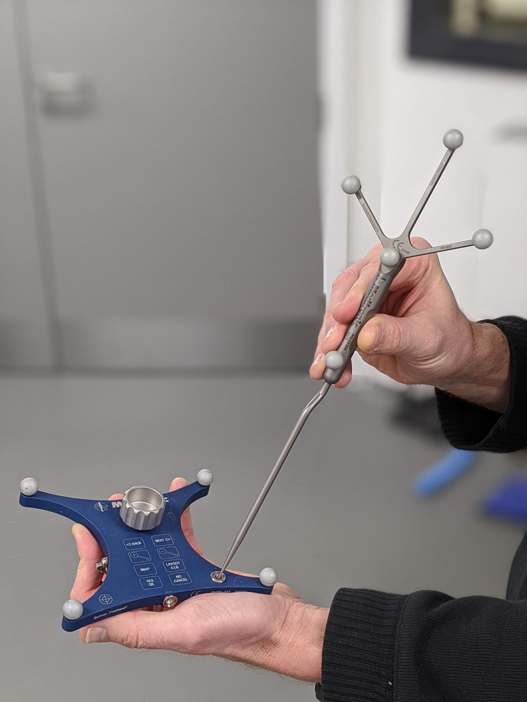

.. _Template:

Template-based tool calibration
===============================

Template-based tool calibration finds the transformation between a tracked marker/sensor and the tip of a tool (e.g., pointer). 
This method can be seen as an equivalent to pivot calibration.
This process consists in placing the surgical instrument in a tracked template with known geometry, in one or more positions. 
Then the spatial relationship can be found by acquiring one or more images.

.. figure:: cascination_template_1.jpg
  :alt: Template-based calibration on the CAScination system. Position 1.
  :width: 300
  
  Template-based calibration on the CAScination system. Position 1.

  
  Template-based calibration on the CAScination system. Position 2.

  
  Template-based calibration on the Medtronic Bucholz Freehand system. Position 1.

  
  Template-based calibration on the Medtronic Bucholz Freehand system. Position 2.

The following video shows how the calibration in the CAScination system is performed:

.. raw:: html

    <iframe width="560" height="315" src="https://www.youtube.com/embed/i8akai5SCZk?start=222" frameborder="0" allow="accelerometer; autoplay; encrypted-media; gyroscope; picture-in-picture" allowfullscreen></iframe>

  
Errors
------
The accuracy of this method mainly depends on how accurately the template is tracked in the acquired images.
The more images are acquired, the most likely the improvement in accuracy.