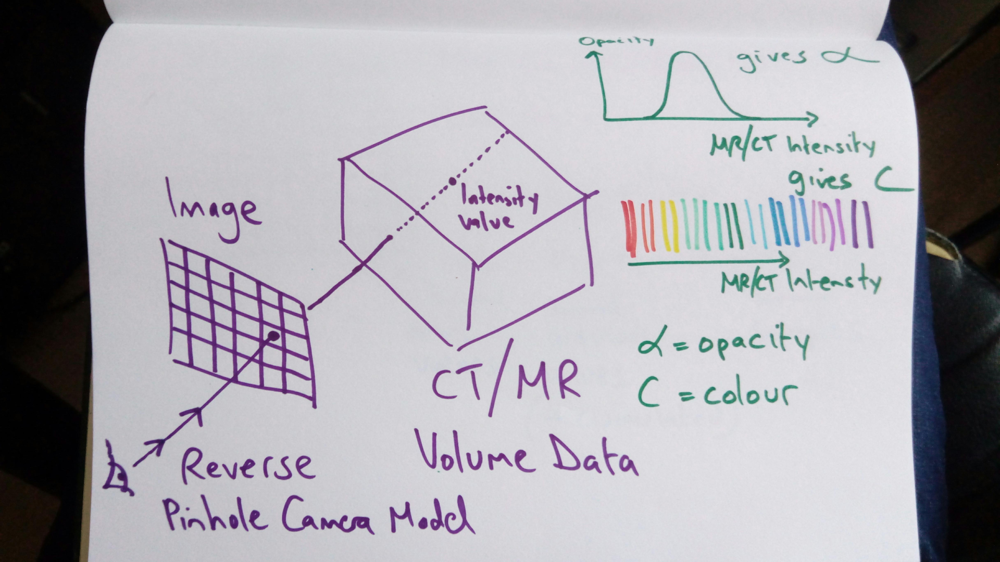
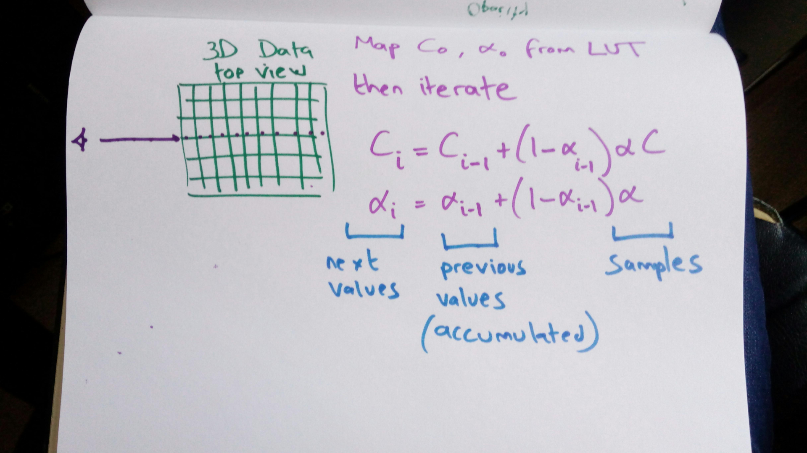

.. _Graphics:

Graphics
========

Introduction
------------

In this section, we give a brief overview of some graphics concepts that
are required for image-guided surgery.

Computer Graphics is a big field, worthy of at least several modules on a computer science course,
and the subject of many a classic text book such as: :ref:`bookFoleyVanDam`, as people build whole
careers in computer graphics and visualisation.

For this course, once you have identified your imaging modalities,
worked out tracking, calibration, registration and segmentation,
we come to the part of "and now put something on the screen".
In order to do that, we will cover basic concepts. Most researchers in
this field are still trying to get the underlying algorithms (registration, calibration) working,
and few are working at improving their visualisation. For a good overview
see [KerstenOertel2013]_, [KerstenOertel2015]_.

We will cover:

* Surface Rendering
* Mesh Decimation
* Mesh Smoothing
* Volume Rendering
* Texture Mapping

Surface Versus Volume Rendering
-------------------------------

In computing at least, "rendering" means "drawing", and "visualisation" is the process of
drawing a picture of data, so the terms "rendering" and "visualisation" are fairly interchangeable.

First, lets look at the two main types of rendering:

Surface Rendering
^^^^^^^^^^^^^^^^^

In this video, we see:

* Contouring, drawing round objects of interest, labelling pixels, resulting in a segmented region.
* Converting segmented regions into triangle meshes.
* Reducing the numbers of triangles, to ensure rendering is fast enough.
* Rendering such a surface, as a solid surface or as wireframe.

.. raw:: html

    <iframe width="560" height="315" src="https://www.youtube.com/embed/Ai8oLmPrm10" frameborder="0" allow="accelerometer; autoplay; encrypted-media; gyroscope; picture-in-picture" allowfullscreen></iframe>

Volume Rendering
^^^^^^^^^^^^^^^^

In this video, we see how volume rendering is different to surface rendering:

* Volume rendering works on voxel data directly.
* There is no explicit segmentation step.
* The value of a pixel in the image is determined by what a ray of light travels through, and functions that map 3D image (e.g. MR/CT) intensity or gradient to opacity and colour.

.. raw:: html

    <iframe width="560" height="315" src="https://www.youtube.com/embed/7DzXGSoCcpU" frameborder="0" allow="accelerometer; autoplay; encrypted-media; gyroscope; picture-in-picture" allowfullscreen></iframe>

Mixed Surface and Volume Rendering
^^^^^^^^^^^^^^^^^^^^^^^^^^^^^^^^^^

You can also mix surface rendering and volume rendering:

.. raw:: html

    <iframe width="560" height="315" src="https://www.youtube.com/embed/m_HJWgqj0yE" frameborder="0" allow="accelerometer; autoplay; encrypted-media; gyroscope; picture-in-picture" allowfullscreen></iframe>

Graphics APIs
-------------

You should be aware that there are many `graphics APIs <https://en.wikipedia.org/wiki/List_of_3D_graphics_libraries>`_.

For someone working in CAS, you need to know there are different levels:

* Low Level: OpenGL, WebGL, Vulkan, Metal
* High Level: VTK, Java3D
* Games Engines: Unity, Unreal

Low Level - OpenGL
^^^^^^^^^^^^^^^^^^

The low level ones, let you explicitly control the graphics card. You
have complete control over every single triangle drawn, or ray cast, but
at the cost of massively increased complexity. Look at `this <https://github.com/MattClarkson/CMakeCatchTemplate/blob/master/Code/GuiApps/QOpenGLDemo/mpOpenGLWidget.cpp>`_ code to draw one triangle!!!

High Level - VTK
^^^^^^^^^^^^^^^^

High level APIs encapsulate the low level detail, and provide a
more easily accessible interface. In addition, they are often wrapped
in a much nicer scripting language (e.g. Python for VTK).

In CAS, lots of research systems use VTK, and so do we in these notes.

VTK Examples
------------

Recently, `Kitware <https://www.kitware.com/>`_ have provided VTK.js, a Javascript re-write of VTK.
Here we show some `VTK.js examples <https://kitware.github.io/vtk-js/examples/>`_, as they can be demonstrated in the browser!!

(Thank you Kitware!)

The code is fairly similar to the `VTK Python or C++ Examples <https://lorensen.github.io/VTKExamples/site/>`_, and the same principles apply throughout.

Cone Example
^^^^^^^^^^^^

Demonstrates:

* Fast rendering, browser uses WebGL, and hence hardware acceleration.
* In surface rendering, everything is typically composed of triangles, points or lines. More complex shapes are made up of lots of triangles.
* OpenGL will render arbitrary polygons, but all polygons can be converted to triangles, and hence the hardware is optimised for triangles, so most people convert all polygons to only triangles.

.. raw:: html

    

        <iframe src="https://kitware.github.io/vtk-js/examples/Cone/index.html" frameborder="0" allowfullscreen style="position: absolute; top: 0; left: 0; width: 100%; height: 100%;"></iframe>
    

The Marching Cubes Algorithm
----------------------------

The Marching Cubes algorithm is used to create a surface from voxel data.
We have already seen this above in the Surface Rendering example.

The Marching cubes [Lorensen1987]_ was published in 1987. The core of the algorithm is explained by the following diagram and video.

.. figure:: MarchingCubesIllustration.png
  :alt: 3 Cases from The Marching Cubes Algorithm
  :width: 600

  Three cases from the Marching Cubes Algorithm. Originally 15 cases proposed.

and this video provides more explanation.

.. raw:: html

    <iframe width="560" height="315" src="https://www.youtube.com/embed/NLsdLUbOvCY" frameborder="0" allow="accelerometer; autoplay; encrypted-media; gyroscope; picture-in-picture" allowfullscreen></iframe>

Here's a simple example, just picking an iso-surface out from a volume:

.. raw:: html

    

        <iframe src="https://kitware.github.io/vtk-js/examples/ImageMarchingCubes/index.html" frameborder="0" allowfullscreen style="position: absolute; top: 0; left: 0; width: 100%; height: 100%;"></iframe>
    

What's going on?

* Set radius to zero.
* Imagine a cube of data in front of the camera. (e.g. 50 x 50 x 50)
* Imagine the values go from zero in the middle to a maximum value (e.g. 100) at the end of the cube.
* At some intermediary value (e.g. 50), we want to extract the surface.
* The marching cubes algorithm will determine where to place the triangles to represent the surface.
* More voxels gives higher resolution.

Marching Cubes Example
^^^^^^^^^^^^^^^^^^^^^^

Here is another example. I believe it was originally generated from a CT scan. So, skin has a low value, and bone has a high value.
As the iso-surface value is changed, the Marching Cubes algorithm is re-run, and a new surface is generated.

.. raw:: html

    

        <iframe src="https://kitware.github.io/vtk-js/examples/VolumeContour/index.html" frameborder="0" allowfullscreen style="position: absolute; top: 0; left: 0; width: 100%; height: 100%;"></iframe>
    

If we look at some `code, <https://kitware.github.io/vtk-js/examples/VolumeContour.html#Source>`_
we see that you don't have to worry about points, and triangles, and array buffers. The VTK provided classes hide the detail.

VTK has a pipeline architecture, you connect things together in a pipeline, then connect your pipeline to a window,
and the system renders the result.

Marching Cubes Video
^^^^^^^^^^^^^^^^^^^^

This video by Sebastian Lague is very helpful:

.. raw:: html

    <iframe width="560" height="315" src="https://www.youtube.com/embed/M3iI2l0ltbE" frameborder="0" allow="accelerometer; autoplay; encrypted-media; gyroscope; picture-in-picture" allowfullscreen></iframe>

Mesh Post-Processing
--------------------

Once a triangle mesh has been created, some post-processing is normally done to
reduce size (decimation), and reduce noise (smoothing). These are briefly
described below and in the accompanying video.

Mesh Decimation
^^^^^^^^^^^^^^^

The aim in mesh-decimation is to remove points without destroying the topology and
general shape of the mesh too much.

In VTK, the `decimation <https://vtk.org/doc/nightly/html/classvtkDecimatePro.html>`_, is based on [Schroeder1992]_.

.. figure:: MeshDecimationIllustration.jpg
  :alt: Illustration of Mesh Decimation in VTK
  :width: 600

  Mesh decimation seeks to remove certain points. See video.

Mesh Smoothing
^^^^^^^^^^^^^^

In VTK, the `smoothing <https://vtk.org/doc/nightly/html/classvtkSmoothPolyDataFilter.html>`_, is based on a
Laplacian smoothing Operator. I (Matt) found `these <http://graphics.stanford.edu/courses/cs468-12-spring/LectureSlides/06_smoothing.pdf>`_ notes helpful.

.. figure:: MeshSmoothingIllustration.jpg
  :alt: Illustration of Mesh Smoothing in VTK
  :width: 600

  Mesh smoothing is implemented using the Laplacian Operator which can be thought of adding a displacement vector, computed as a weighted offset towards the mean of the neighborhood. See video.

Mesh Decimation and Smoothing Video
^^^^^^^^^^^^^^^^^^^^^^^^^^^^^^^^^^^

More details describing the above decimation and smoothing diagram can be found in this video:

.. raw:: html

    <iframe width="560" height="315" src="https://www.youtube.com/embed/Dps_UGngAX8" frameborder="0" allow="accelerometer; autoplay; encrypted-media; gyroscope; picture-in-picture" allowfullscreen></iframe>

Volume Rendering
----------------

The following diagrams and video illustrate the basic concept of volume rendering.

  Volume Rendering in medical imaging, is implemented via Ray Casting. Imagine the reverse of a pinhole model. For each image pixel, project a ray into space, and evaluate the voxel intensity values along each step through the volume. See video.

  At each step along the ray, you evaluate a function to compute the value of the resultant pixel. Functions depend on the volume data value, the opacity transfer function and colour transfer functions. See video.

.. raw:: html

    <iframe width="560" height="315" src="https://www.youtube.com/embed/QdNW_IUIrow" frameborder="0" allow="accelerometer; autoplay; encrypted-media; gyroscope; picture-in-picture" allowfullscreen></iframe>

You should now have a fair idea of what the following VTK.js example is doing:

.. raw:: html

    

        <iframe src="https://kitware.github.io/vtk-js/examples/PiecewiseGaussianWidget/index.html" frameborder="0" allowfullscreen style="position: absolute; top: 0; left: 0; width: 100%; height: 100%;"></iframe>
    

For the above example, the instructions for use are `here <https://kitware.github.io/vtk-js/examples/PiecewiseGaussianWidget.html>`_.

Other types of volume rendering include:

* MIP = Maximum Intensity Projection. For each ray, just extract the maximum value along the ray path.
* Average Intensity Projection. Like MIP, but extract average intensity. Not widely used.
* Minimum Intensity Projection. Like MIP, but extract minimum intensity. Not widely used.

Texture Mapping
---------------

The final technique we will look at is texture mapping.

Texture mapping is a way of assigning an :math:`(t_x, t_y)` value to a vertex,
where the values of :math:`(t_x, t_y)`, which normally range :math:`[0-1]` refer to locations in an image. i.e. a pixel array.
When it comes time to render a polygon, then instead of just painting the polygon a single colour, the texture image is painted on top of the polygon.

This was developed initially to add repeating textures that could be rendered very quickly. Graphics hardware soon had dedicated processors to
do this in real-time, giving much improved visual effects.

See `this page <https://learnopengl.com/Getting-started/Textures>`_ for examples. So rather than have to produce
polygon models and work out how to mathematically define a colour function that looked like wood/metal/grass for example,
you can just take a photo, store the picture as a texture map, and map the coordinates of your triangles into the texture map.
This gave very much enhanced realism, at fast rendering speeds.

By why mention this for medical imaging?

Take a look at this example:

.. raw:: html

    

        <iframe src="https://kitware.github.io/vtk-js/examples/MultiSliceImageMapper/index.html" frameborder="0" allowfullscreen style="position: absolute; top: 0; left: 0; width: 100%; height: 100%;"></iframe>
    

In this example, there are 3 image planes, axial, sagittal and coronal. How are they drawn on screen?

Each slice is extracted and mapped to a bit of texture memory. Then for each slice, you define 4 points that represent
the location in space of the corners. The graphics subsystem then simply maps the value of the image onto the correct
location in space. In other words, you are rendering 3 squares, where each square is rendered as a texture map.

i.e. you don't paint these pixels 1 by 1.

So, in this way, the location in space can be changed very quickly as the graphics hardware can rotate/translate
the objects using hardware acceleration. If you change the slice then the image data can be remapped onto texture memory very quickly,
and the picture redrawn.

