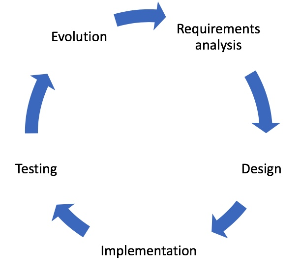

.. _HCIInANutshell:

Human Computer Interaction (HCI)
================================

Introduction
------------

Following the previous lecture on :ref:`VisualisationAndMultiModalInteraction`
Prof. Ann Blandford now gives an overview of the field Human Computer Interaction (HCI).

Video
-----

.. raw:: html

    
<iframe src="https://mediacentral.ucl.ac.uk/player?autostart=n&fullscreen=y&width=0&height=0&videoId=Jf7ciiII&captions=n&chapterId=0" frameborder="0" scrolling="no" style="position:absolute;top:0;left:0;width:100%;height:100%;" allowfullscreen></iframe>

Notes
-----

Learning Objectives
^^^^^^^^^^^^^^^^^^^

   - To understand what HCI is and why it matters in technology development.
   - To become aware of a range of approaches to understanding users’ needs and practices, and representing them for design.
   - To become aware of a range of approaches to testing novel technologies during design and deployment.

Introduction to HCI and user-centred development processes
^^^^^^^^^^^^^^^^^^^^^^^^^^^^^^^^^^^^^^^^^^^^^^^^^^^^^^^^^^

HCI = Human–Computer Interaction – i.e., the study and practice of designing
technologies that work well for people.

This addresses several challenges not least of which is that to developers
it always seems obvious how their design works, and it’s really hard to view
it through another person’s eyes. This is particularly the case when that other
person has really different background and expertise, as is usually the case for
health technologies.

Interactive healthcare technologies need to be fit for purpose. They need to work reliably, but also…

   - “If the user can’t use it, it doesn’t work” (quotation from Susan Dray, Dray & Associates).
   - If the user doesn’t need it then it doesn’t work.

For health technologies, this involves designing and evaluating systems for:

   - Efficiency, effectiveness & satisfaction.
   - Improving health and wellbeing.
   - Supporting and enhancing human effectiveness.
   - Interoperability and fit within context.

…and more.

We can think of this in terms of “quality layers”:

.. figure:: SevenLessonsPyramid.jpg
  :alt: Diagram of Blandford 2018, Seven Lessons Pyramid
  :width: 600

  Source: Blandford, A., Gibbs, J., Newhouse, N., Perski, O., Singh, A., & Murray, E. (2018). Seven lessons for interdisciplinary research on interactive digital health interventions. Digital health, 4, 2055207618770325. Reproduced with permission.

**A classic System development lifecycle**

  System development Lifecycle

Methods for requirements gathering
^^^^^^^^^^^^^^^^^^^^^^^^^^^^^^^^^^

(understanding users’ needs and practices)

To design the future, you need to understand the present. Methods for understanding
the present include:

   - Reference to existing resources (e.g. systems, manuals, protocols).
   - Observation of work.
   - Interviews.
   - Contextual Inquiry.

In the time available, we cannot discuss all of these in detail, but see for example
[Blandford2016]_ for more on how to plan user studies involving observations and interviews.
For today, we will focus on Contextual Inquiry [BeyerHoltzblatt1999]_.

**Contextual Inquiry in a nutshell**

Contextual Inquiry combines observations with interviews. The text books suggest
that it should be conducted by a team of designers / observers, who then share understanding,
but it can very usefully be conducted by individuals too. There are some basic
principles that a Contextual Inquiry adheres to:

   - Context: Takes place in the workplace.
   - Ongoing Experience: Involves observation and questioning.
   - Concrete data: Focus on real artefacts and events.
   - Partnership: Data gatherer works with user on understanding their work experience. This recognises that they are experts in their work.

The process for conducting a Contextual Inquiry is:

   - Observe then query. For example:

      - Who do you get that information from?
      - What happens when you press that?
      - When do you need to complete that action?
      - Where do you keep the parts for that?
      - How do you know when to start doing that?
      - Why is that highlighted?

   - Interpret findings in terms of meaning.

   - Construct models to describe the activity in terms of the “system of work”.

      - Flow model: focus on communications.
      - Sequence model: focus on order of events.
      - Artefact model: noting reasons for structure.
      - Cultural model: noting roles and relationships.
      - Physical model: noting influences of the environment.

Data collection and interpretation should focus on features that matter for design –
for example, points of difficulty / vulnerability and opportunities for improvement / intervention.

Methods for representing requirements for design
^^^^^^^^^^^^^^^^^^^^^^^^^^^^^^^^^^^^^^^^^^^^^^^^

Design is inherently creative. However, there are various methods for representing
user requirements for design. These complement (and often precede) software engineering
representations such as UML diagrams. Widely used representations include:

   - Use of personas and scenarios.
   - Sketching and prototyping.
   - Use of storyboards.
   - Drawing on design patterns / analogous solutions.

**Personas and Scenarios**

A persona is a rich (evidence-based) description of a typical user of the intended system.
Personas provide a ‘tool for thinking’ that encapsulate features of Real Users.
They are intended to help developers to overcome two common temptations when envisioning users:

   - The users are just like me. They know as much as I do about my design, so it will be obvious to them how it works.
   - The users are exploring the system to see what is possible with it, and need little knowledge to do that.

Scenarios focus on user activity and motivations, rather than system functions.
They are therefore similar to, but not the same as, use cases. They describe how the user(s)
will use the system in context, and might be at different levels of abstraction (describing
the broad work context or the details of particular interactions, for example).

**Sketches and prototypes**

A prototype is a representation of some aspects of design that helps with idea-generation,
communication and evaluation. E.g.

   - Physical mock-up.
   - Paper sketches of screens.
   - Complex demonstrator software.

Prototypes can serve various roles during design. For example, they can support:

   - Communication within design team.
   - Communication between design team and stakeholders.
   - Encouraging reflection on design.
   - Clarifying requirements.
   - Doing early user testing.

**Storyboards**

Storyboards are like cartoon strips, but not necessarily linear. They bring together
scenarios and low-fidelity prototypes. They may focus on screens or on user activities.

Methods for formative and summative evaluation of novel technologies
^^^^^^^^^^^^^^^^^^^^^^^^^^^^^^^^^^^^^^^^^^^^^^^^^^^^^^^^^^^^^^^^^^^^

Throughout design, it is necessary to check proposed solutions against the user requirements.
In software engineering terms, this is commonly referred to as “validation”.
In lay language, system verification asks the question “Have you built the system right?”
while validation asks “Have you built the right system?”.

At the end of a development process, it is usually necessary to do a summative
evaluation to demonstrate (e.g., for regulatory purposes) that the system performs
as intended and is usable and effective. During the process, it is good practice
to conduct rounds of formative testing with prototype systems to check that things
are heading in the right direction and to inform the next development cycle.

Approaches to formative testing include:

   - Expert review.
   - Laboratory / simlab testing with users.
   - Think-aloud testing with users.

For medical devices seeking regulatory approval, there are likely to be subsequent
clinical trials or other pre-market approval processes, but that is out of scope for today.

For any HCI testing, it is important to consider what you are evaluating.
No study can cover everything, so what are the most important considerations
at the current stage of development? E.g.:

   - Accuracy.
   - Efficiency.
   - Safety.
   - Effectiveness.
   - User experience

**Expert review**

Expert review of an early prototype or implemented system involves

   - Defining some user tasks (typical and edge-case).
   - Walking through the system interaction systematically looking for usability issues.

Expert review typically assesses usability, not utility. In other words, it assesses
whether the system is easy to use, not whether it is the right system!

In defining user tasks, it is necessary to decide:

   - Who will the users be? – what can you assume about their prior experience and knowledge?
   - What tasks are to be analysed? And what is the correct action sequence for each task?
   - How is the interface defined?

A widely used method of expert review is Heuristic Evaluation (see www.nngroup.com for details).
A heuristic is a “rule of thumb” – e.g.: “Help users recognise, diagnose and recover from errors”.
A set of heuristics provides a structure for evaluating a system, like a checklist.

Doing a heuristic evaluation involves working systematically through the system – e.g. all
screens / states needed to complete selected tasks. There are several different versions
of Heuristic Evaluation; they’re all similar, but differ in the details.

**Testing with users**

User testing involves working with representative users of a system to identify
areas of difficulty with a system.User testing is usually done relatively late
in development process (except where there are particular questions that need
to be addressed earlier).

   - Tasks may be defined by analyst or user.
   - Setting may be more or less realistic.
   - Measures may be quantitative (e.g. time to complete task; number of errors).
   - ...or qualitative (e.g. user difficulties or perceptions).

Sometimes it’s necessary to compare two or more alternatives:

   - New vs existing processes to validate that new is “better”.
   - Alternative ways of doing things when you’re not sure which to develop.

When evaluating whether something is “better”, it’s necessary to decide how “better” is defined.
For example this might be: fewer errors, faster, better clinical outcomes, more economical,
less stressful, etc.

It is also essential to consider how “better” is measured. For example, this might be
error rate, task execution time, user satisfaction (measured through a validated survey), etc.

When planning a study, it is necessary to decide:

   - Who should participate, and how many?
   - How to recruit?
   - What are they to do?
   - What version(s) of a system / component are being tested?
   - What is being measured, and how?
   - How is data being gathered and analysed?

...before running any study. If it is well planned, then the actual running of a
study should be relatively straightforward. Often, for medical systems, the
hardest thing to do is recruiting participants, but that is a whole extra
topic in its own right.

**Think-aloud protocol for gathering user perceptions and difficulties**

One common approach to testing an interface (of any kind) is to ask participants
to think aloud while using the interface. If this is done in a lab setting,
then it is usual to give participants pre-define tasks. If it is done in the “real world”
then it is more common to let users define their own tasks. In brief, conducting
a think-aloud involves four main steps:

   - Instructing users on what to talk about while working.
   - Recording (and maybe transcribing) the thoughts that are articulated – e.g., using screen capture; user action logging; audio; or video.
   - Analysing the data, such as noting particular event types (e.g. errors, uncertainties, design suggestions).
   - Identifying design implications.

If the study is naturalistic then you don’t need to define tasks, but
you probably want to know what people are aiming to achieve. If it’s a lab
study then you need to tell participants what to do – both what tasks to perform
and how to think aloud.

In designing task instructions, you need to consider:

   - Specificity of task (how much freedom of choice do you want participants to have).
   - How much detail you give about how to complete task.
   - Need to describe activities in a form that makes sense to participants.

      - Sometimes, create a scenario to add realism to tasks.
      - Scenario must be one with which participants can identify.

As noted above, you also need to explain how to “think aloud”.

**User testing of implemented system and redesign**

No design is ever complete. Designs always evolve (or become obsolete)
So it is necessary to keep monitoring the use of systems – particularly medical devices.
Approaches include:

   - Post-market surveillance.
   - User feedback.
   - Observations / interviews of practice.

New designs create new opportunities for use (think back to how you used a phone
even ten years ago, compared with how you use it now). There is a co-evolution
between design and use. Some new uses may be positively regarded. Others (workarounds,
violations) expose design limitations.

Methods for understanding evolved practices include the interviews, observations and
Contextual Inquiry that are used to identify user requirements in the first place.
Once you know what the problems are, they need to be prioritised:

   - How easy to fix?
   - How critical?

And it is necessary to decide whether to make changes in the current development
cycle or the next one. But if changes are to be as good as possible it’s necessary
to check that you really understand user requirements, values and practices.

User-centred design and user-centred innovation
^^^^^^^^^^^^^^^^^^^^^^^^^^^^^^^^^^^^^^^^^^^^^^^

To design the future, you need to understand the present. Revolutions in use are rare,
and are generally just fast evolutions!
Innovation is essential, but needs to be shaped by an understanding of people’s
needs and practices.
There are many resources to support user-centred design [Sharp2019]_.
 

Paper Discussion
----------------

These notes and lectures were prepared during the COVID-19 pandemic, so the lecture was
switched to a paper discussion. The following video introduces the paper
[Tourancheau2012]_, which we will discuss via video conference.

.. raw:: html

    
<iframe src="https://mediacentral.ucl.ac.uk/player?autostart=n&fullscreen=y&width=0&height=0&videoId=19E32AGH&captions=n&chapterId=0" frameborder="0" scrolling="no" style="position:absolute;top:0;left:0;width:100%;height:100%;" allowfullscreen></iframe>

