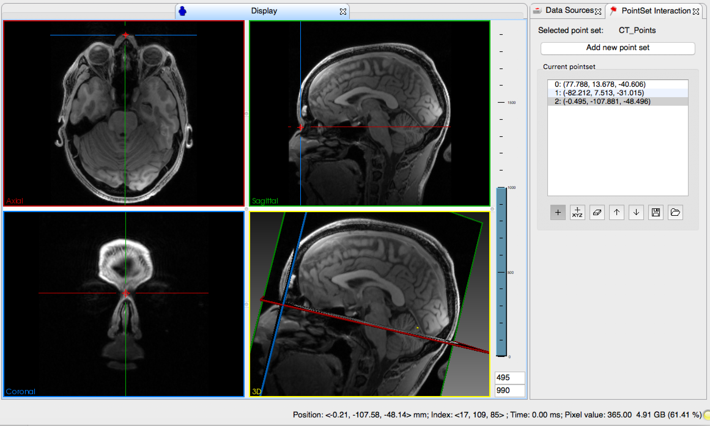
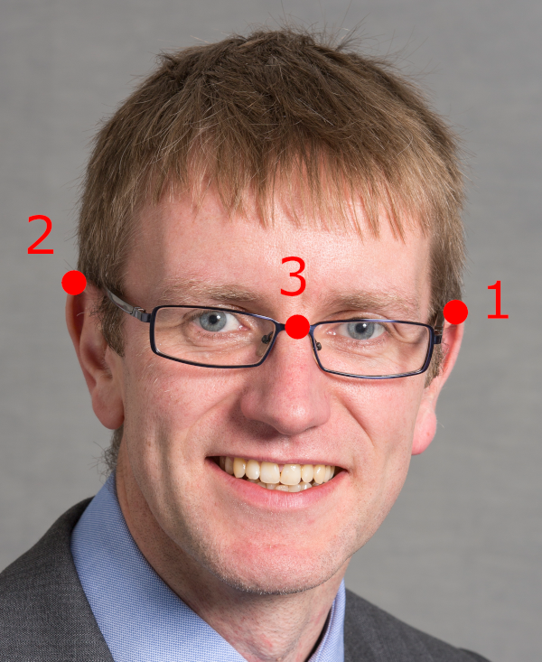

.. _PointBasedRegistration:

Point-Based Registration
========================

Examples
^^^^^^^^

  Figure 1: (top) At least 3 points are selected in pre-operative data such as MR/CT. (bottom) The same 3 points are measured in physical space, using a coordinate measuring device, such as a tracker.

Here's an example of how markers are used for point-based registration in neurosurgery, from the `Mayfield Brain & Spine YouTube channel <https://www.youtube.com/watch?v=_BFTK6LWH5g&feature=youtu.be>`_:

.. raw:: html

    <iframe width="560" height="315" src="https://www.youtube.com/embed/_BFTK6LWH5g" frameborder="0" allow="accelerometer; autoplay; encrypted-media; gyroscope; picture-in-picture" allowfullscreen></iframe>

and another example from `CASCination <http://cascination.com>`_ in abdominal surgery, on the `ECALS 2014 channel <https://youtu.be/i8akai5SCZk>`:

.. raw:: html

    <iframe width="560" height="315" src="https://www.youtube.com/embed/i8akai5SCZk" frameborder="0" allow="accelerometer; autoplay; encrypted-media; gyroscope; picture-in-picture" allowfullscreen></iframe>

The CASCination system uses a long pointer, picking 4 points on the liver - see `supplementary material <https://www.journalacs.org/cms/10.1016/j.jamcollsurg.2016.06.392/attachment/a000fb26-217c-481e-a7e6-4b0a2e826b5c/mmc1.mp4>`_
in [Conrad2016]_, namely left/middle hepatic vein drainage, main portcal vein drainage,
insertion of fulsiform ligament, insertion of gallbladder dome. Also see [Prevost2019]_.

Papers
^^^^^^

The point-based alignment algorithm, often called the `Orthogonal Procrustes Algorithm <https://en.wikipedia.org/wiki/Orthogonal_Procrustes_problem>`_,
can be solved in a variety of manners. In the research literature, most people reference:

* [Arun1987]_, using SVD
* [Horn1987]_, using quaternions

and [Eggert1998]_ suggests there is not much difference between them.

The above papers all assume isotropic, independent fiducial localisation error.
There is a body of work looking at error propagation in cased where this is not valid,
e.g. [Batchelor2000]_, [Wiles2008]_, [Moghari2009]_, [Danilchenko2010]_, [Thompson2013]_.

Algorithm
^^^^^^^^^

Please see the above papers for the maths. The method from [Arun1987]_ can `best seen in code in SciKit-Surgery <https://github.com/UCL/scikit-surgerycore/blob/master/sksurgerycore/algorithms/procrustes.py>`_.

Fiducial marker types
^^^^^^^^^^^^^^^^^^^^^

Accuracy is determined by the fiducial marker type, and the ability to accurately measure fiducial location in the OR.

* Bone implanted screws, detachable heads. See [Maurer1998]_.
* `Stick on markers <https://izimed.com/products/multi-modality-markers>`_, seen in Mock OR, in Workshop 1, and the above video from the `Mayfield Brain & Spine YouTube channel <https://www.youtube.com/watch?v=_BFTK6LWH5g&feature=youtu.be>`_.
* Bite-blocks [Edwards2000]_.

Typical Performance
^^^^^^^^^^^^^^^^^^^

Pros:

* Easy to implement for rigid
* Robust. Need 3+ points. Algorithm won't randomly "fail" as such
* Easy to validate, on a phantom, and get approved, as the method transfers well from phantom to clinical cases
* With a clear protocol, less user dependent than manual registration

Cons:

* Not suitable for non-rigid alignment
* Need rigid landmarks, so most suitable for neurosurgery or orthopedics
* Surgery is often draped, might be difficult to use markers in practice
* Needs case by case analysis of registration errors, as errors are very shape dependent

Accuracy:

* Neurosurgery: 0.5-1mm on Fiducials, 0.5-4mm on Targets, e.g. [Edwards2000]_.
* Neurosurgery: Similar range of errors, and a good explanation of FLE, FRE, TRE etc. [Shamir2009]_.
* Liver surgery: Time was median 8:50 min. Accuracy (FRE), 14.0mm to 9.2mm, mean 12.8mm [Prevost2019]_.

Notebooks
^^^^^^^^^

Have a play with the provided :ref:`Notebooks`.

Python Implementation
^^^^^^^^^^^^^^^^^^^^^

SciKit-Surgery provides the main algorithms:

.. code::

    # Note that the SNAPPY libraries provide point-based registration using Arun's method and matrix utilities.
    import sksurgerycore.algorithms.procrustes as pbr
    import sksurgerycore.transforms.matrix as mu

so Arun's algorithm is `here <<https://github.com/UCL/scikit-surgerycore/blob/master/sksurgerycore/algorithms/procrustes.py>>`_

and can be installed with:

.. code::

    pip install scikit-surgerycore
