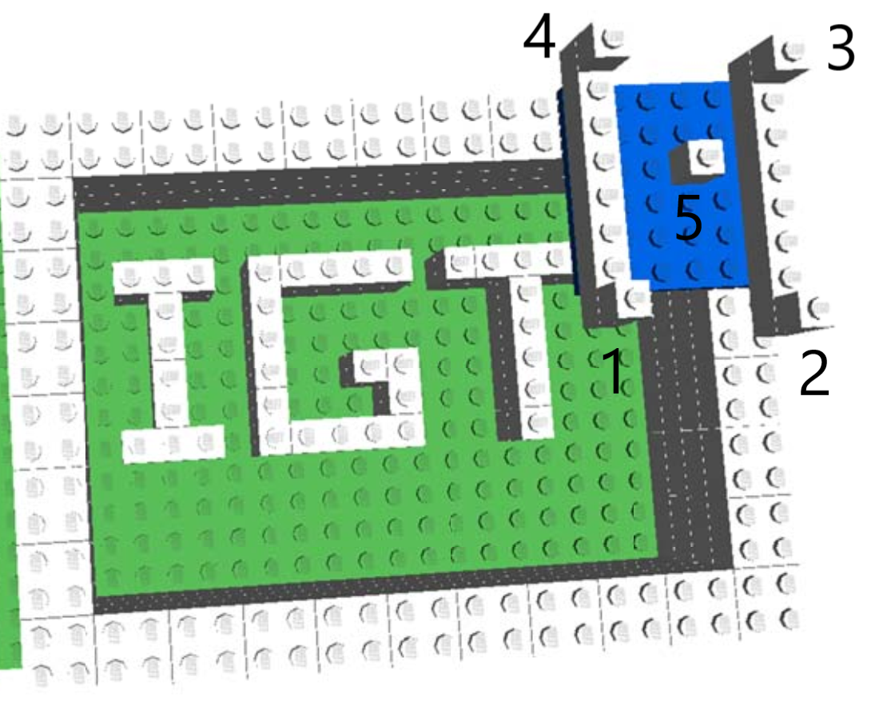

.. _Workshop1Lego:

Workshop 1: Lego Phantom, ArUco Tracker, Windows
================================================

Assumes you have installed

* `gitbash.exe <https://git-scm.com/>`_.
* `NiftyIGI.exe <https://github.com/NifTK/NifTK/releases>`_.
* `MPHY0026 repo <https://weisslab.cs.ucl.ac.uk/WEISSTeaching/MPHY0026>`_.

Note: all command line tools below respond to the ``--help`` argument to describe available options

We will be tracking Aruco tags using a webcam. Before beginning, check the webcam positioning to ensure that the Aruco tag is visible when probing the phantom.

1. Locate 5 fiducials in order in physical space
^^^^^^^^^^^^^^^^^^^^^^^^^^^^^^^^^^^^

* Ensure the tracker is on.
* Place the pointer in the first fiducial.

  Figure 1: Location of 5 fiducial markers to be used.

* Use the command line tool to record the location of the points::

    python mphy0026_grab_pointer.py -t aruco -p 0 -o tests/data/lego/aruco_pointer_offset.txt -f 0.2 -n 5 -d tracker.txt

This will grab a frame every 5 seconds (fps of 0.2), allowing time to move the pointer to each fiducial in turn.

N.B. The Pointer tip offset is at ``-154.43 -24.17 3.14``, and is stored in file ``tests\data\lego\aruco_pointer_offset.txt``. This has been obtained by pivot calibration, which will be covered in next week's materials.

2. Register Physical Space to Image Space
^^^^^^^^^^^^^^^^^^^^^^^^^^^^^^^^^^^^^^^^^

The ct fiducial positions are provided in ``tests/data/lego/ct_fiducials.txt``

You can compute a point based registration using Arun's method::

    python mphy0026_registration.py -f tests/data/lego/lego_ct_fiducials.txt -m tracker.txt -o tracker-to-ct-using-PBR.txt

(Note: CT points can be saved for later use. Physical space points cannot.
Someone might move the phantom or tracker inbetween runs.)

3. Display Registered CT scan With Pointer
^^^^^^^^^^^^^^^^^^^^^^^^^^^^^^^^^^^^^^^^^^

The registration can be used to visualise the CT at the pointer tip::

    python mphy0026_quadview.py -t aruco -v tests/data/lego/lego.nii  -reg tracker-to-ct-using-PBR.txt -p 0 -o tests/data/lego/aruco_pointer_offset.txt

4. Grab Data for ICP
^^^^^^^^^^^^^^^^^^^^

The same pointer program can also grab data for surface based registration using ICP. We will grab 500 frames at 10 fps from the Aruco tracker.

* Assign 1 person to be dragging the pointer.
* Place the pointer on the phantom.
* Any movement of the phantom during collection will result in larger errors.
* Start grabbing data::

    python mphy0026_grab_pointer.py -t aruco -p 0 -o tests/data/lego/aruco_pointer_offset.txt  -f 10 -n 500 -d surface.txt

* The person dragging the pointer should not lift/remove from the surface, as the tracker will keep tracking.
* If the tracker fails to detect the pointer (i.e. pointer is obscured), the output on console will stop, and data collection will stop.
* Once complete, the file ``surface.txt`` should contain 500 rows of point data, representing the physical location of the surface.

5. Register ICP data to VTK surface
^^^^^^^^^^^^^^^^^^^^^^^^^^^^^^^^^^^

* The program used for point based registration can also do ICP. Once you have collected surface.txt, do::

    python mphy0026_registration.py -f tests/data/lego/lego.vtk -m surface.txt -o tracker-to-ct-using-ICP.txt

* Look at the residual. Does it look high/low?
* You could test the alignment, by re-running the quadviewer program using `tracker-to-ct-using-ICP.txt` in place of the point-based one.
* Its probably bad due to poor initialisation.
* So, use the Point-Based Registration to initialise::

    python mphy0026_registration.py -f tests/data/lego/lego.vtk -m surface.txt -o tracker-to-ct-using-ICP.txt -i tracker-to-ct-using-PBR.txt

* The residual should be much lower, and you can re-run the quad viewer (with the new registration file) to confirm its registered::

    python mphy0026_quadview.py -t aruco -v tests/data/lego/lego.nii  -reg tracker-to-ct-using-ICP.txt -p 0 -o tests/data/lego/aruco_pointer_offset.txt

* Repeat, using much fewer points?
* Repeat, using points from a very flat/boring/planar area of the phantom?
* Repeat, manually jittering the pointer up and down, to simulate poor data. When does registration fail?

6. Calculation of TRE
^^^^^^^^^^^^^^^^^^^^^

* For PBR, this can be achieved by, registering using fewer points (at least 3), and using the remaining point as a target.
* For ICP, as the fiducials are not used for registration, these can be used directly.
* BUT - you ideally need to measure physical space, using an independent measure, eg. ruler.
* If you take a CT fiducial position, and convert to tracker/physical space, and measure the distance from the predicted position to the actual position, you have also included CT FLE.

7. Report Back
^^^^^^^^^^^^^^

* Huddle round at end of session.
* We want to record, for each group a *typical* FLE (CT), FLE (Tracker), FRE, TRE (Point-Based), TRE (ICP).
* This does not have to be terribly rigorous. Its a learning exercise, so even 1 repetition will do.

