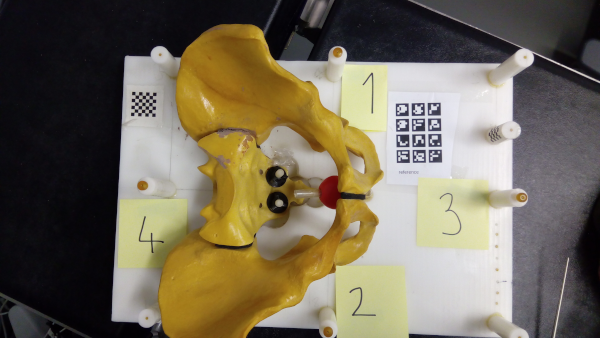
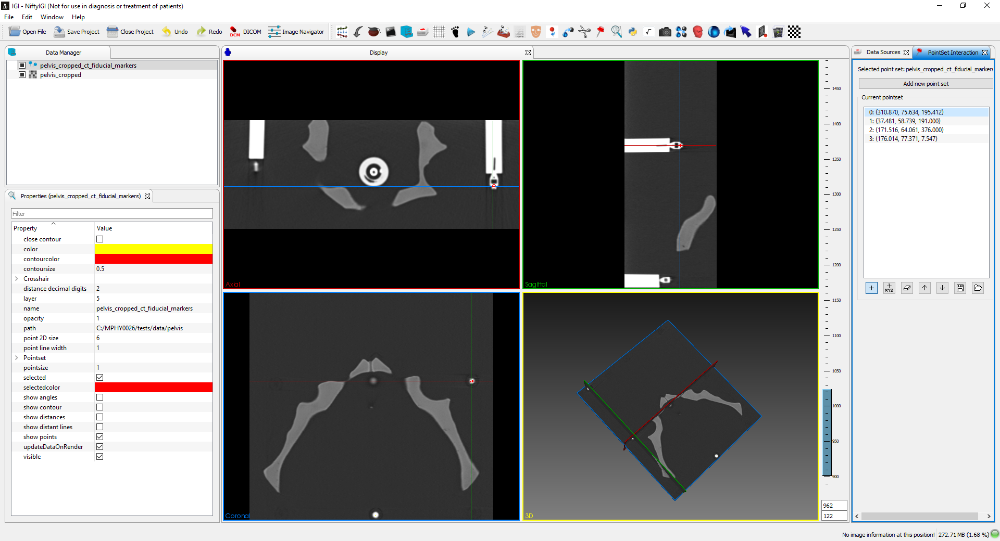
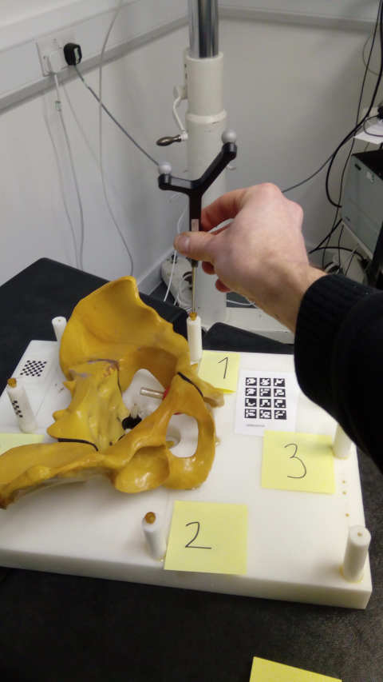

.. _Workshop1Pelvis:

Workshop 1: UCL Pelvis Phantom, Optical Tracker, Windows
========================================================

Required Software
^^^^^^^^^^^^^^^^^

Assumes you have installed

* `gitbash.exe <https://git-scm.com/>`_.
* `NiftyIGI.exe <https://github.com/NifTK/NifTK/releases>`_.
* `MPHY0026 repo <https://github.com/UCL/MPHY0026>`_.

Note: all command line tools below should be run from the MPHY0026/ directory. Each program will respond to the ``--help`` argument to describe available options.


1. Locate 4 fiducials in order in CT
^^^^^^^^^^^^^^^^^^^^^^^^^^^^^^^^^^^^

1. On the pelvis phantom, there are 4 fiducials. They are numbered.



  Figure 1: Four fiducials, numbered and hence ordered.

2. Run NiftyIGI.exe (or similar medical image viewer of your choice).
3. Load the image ``tests\data\pelvis\pelvis_cropped.nii``
4. Adjust the window/level (right hand, vertical slider), to get a good contrast, write these numbers for later, e.g. 962, 122. These are is Level/Window. Convert to Min/Max.
5. Write down the 3D location (look on bottom status bar), of each of 4 points in order.



  Figure 2: Illustration, of NiftyIGI, showing CT volume at a fiducial point.

6. Save the 4 points as 4 rows of x y z (space separated) into a text file of your choice
7. Compare with ``tests\data\pelvis\pelvis_cropped_ct_fiducial_markers.txt``
8. If you didn't achieve this first step, continue using ``tests\data\pelvis\pelvis_cropped_ct_fiducial_markers.txt``
9. Repeat step 5, 6 multiple times to estimate FLE at each point.
10. (Optional) Compare with other students. What is the variance in FLE?

Caveat:

* Compare ``tests\data\pelvis\pelvis_nii_ct_fiducial_markers.txt`` with ``tests\data\pelvis\pelvis_cropped_ct_fiducial_markers.txt``. They are different.
* VTK does not load the origin, or the orientation of each axis, as it wasn't designed for medical file formats.
* So for simplicity, we switched to a .nii file which in this specific case does not have a non-zero origin.
* In practice, certiainly in research circles, ALWAYS be aware that various file format conversions can forget/miss things like the origin in space, voxel dimensions etc.


2. Locate 4 fiducials in order in Physical Space
^^^^^^^^^^^^^^^^^^^^^^^^^^^^^^^^^^^^^^^^^^^^^^^^

* Ensure the tracker is on
* Place the pointer in the first fiducial, facing the tracker




  Figure 2: Placing optically tracked pointer in fiducial, facing tracker.

Use the command line tool to grab record the location of the points::

    python mphy0026_grab_pointer.py -t vega -p doc/notebooks/NDIGeometries/8700340.rom -o tests/data/pelvis/optical-pointer-offset.txt -f 0.2 -n 4 -d tracker.txt

This will grab a frame every 5 seconds (fps of 0.2), allowing time to move the pointer to each fiducial in turn.

N.B. The Pointer tip offset is at ``-17.91 0.95 -157.72``, and is stored in file ``tests\data\pelvis\optical-pointer-offset.txt``. You will learn pivot calibration next week.


3. Register Physical Space to Image Space
^^^^^^^^^^^^^^^^^^^^^^^^^^^^^^^^^^^^^^^^^

* Given CT landmarks (use either the provided values, or the ones you collected) and tracker landmarks in a file called ``tracker.txt``, you can compute Arun's method as::

    python mphy0026_registration.py -f tests/data/pelvis/pelvis_cropped_ct_fiducial_markers.txt -m tracker.txt -o tracker-to-ct-using-PBR.txt

The program reports FRE, which typically should be < 1, mostly < 0.75

(Note: CT points can be saved for later use. Physical space points cannot.
Someone might move the phantom or tracker inbetween runs.)

4. Display Registered CT scan With Pointer
^^^^^^^^^^^^^^^^^^^^^^^^^^^^^^^^^^^^^^^^^^

The registration can be used to visualise the CT at the pointer tip::

    python mphy0026_quadview.py -t vega -v tests/data/pelvis/pelvis_cropped.nii  -reg tracker-to-ct-using-PBR.txt -p doc/notebooks/NDIGeometries/8700340.rom -min 901 -max 1023 -o tests/data/pelvis/optical-pointer-offset.txt


5. Grab Data for ICP
^^^^^^^^^^^^^^^^^^^^

The same pointer program can also grab multiple frames of data. The VEGA hardware works up to 250 fps.
We haven't yet tested the speed via Python. Lets assume 30 fps.

So, if we want 900 points of data, at 30 frames per second that is about 30 seconds of data collection.

* Assign 1 person to be dragging the pointer.
* Place the pointer on the pelvis phantom.
* Start grabbing data::

    python mphy0026_grab_pointer.py -t vega -p doc/notebooks/NDIGeometries/8700340.rom -o tests/data/pelvis/optical-pointer-offset.txt  -f 30 -n 900 -d surface.txt

* The person dragging the pointer should not lift/remove from the surface, as the tracker will keep tracking.
* If the tracker fails to detect the pointer (i.e. pointer is obscured), the output on console will stop, and data collection will stop.
* Once complete, the file ``surface.txt`` should contain 900 rows of point data, representing the physical location of the surface.

6. Register ICP data to VTK surface
^^^^^^^^^^^^^^^^^^^^^^^^^^^^^^^^^^^

* The program used above to register will also do ICP. Once you have collected surface.txt, do::

    python mphy0026_registration.py -f tests/data/pelvis/pelvis_cropped_decimated.vtk -m surface.txt -o tracker-to-ct-using-ICP.txt

* Look at the residual. Does it look high/low?
* You could test the alignment, but using the ```tracker-to-ct-using-ICP.txt``` in place of the point-based one above.
* Its probably bad due to poor initialisation.
* So, use the Point-Based Registration to initialise::

    python mphy0026_registration.py -f tests/data/pelvis/pelvis_cropped_decimated.vtk -m surface.txt -o tracker-to-ct-using-ICP.txt -i tracker-to-ct-using-PBR.txt

* The residual should be much lower, and you can re-run the quad viewer to confirm its registered::
	
	python mphy0026_quadview.py -t vega -v tests/data/pelvis/pelvis_cropped.nii  -reg tracker-to-ct-using-ICP.txt -p doc/notebooks/NDIGeometries/8700340.rom -min 901 -max 1023 -o tests/data/pelvis/optical-pointer-offset.txt

* Repeat, using much fewer points?
* Repeat, using points from a very flat/boring/planar area of the phantom?
* Repeat, manually jittering the pointer up and down, to simulate poor data. When does registration fail?

7. Calculation of TRE
^^^^^^^^^^^^^^^^^^^^^

* For PBR, this can be achieved by, registering using fewer points (at least 3), and using the remaining point as a target.
* For ICP, as the fiducials are not used for registration, these can be used directly.
* BUT - you ideally need to measure physical space, using an independent measure, eg. ruler.
* If you take a CT fiducial position, and convert to tracker/physical space, and measure the distance from the predicted position to the actual position, you have also included CT FLE.

8. Report Back
^^^^^^^^^^^^^^

* Huddle round at end of session.
* We want to record, for each group a *typical* FLE (CT), FLE (Tracker), FRE, TRE (Point-Based), TRE (ICP).
* This does not have to be terribly rigorous. Its a learning exercise, so even 1 repetition will do.


