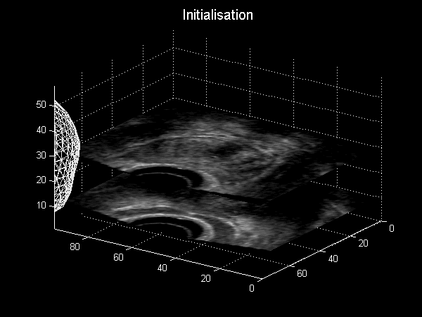

.. _StatisticalShapeModels:

Statistical Shape Models
========================

(Pioneered in the medical domain by `Prof. Tim Cootes <https://personalpages.manchester.ac.uk/staff/timothy.f.cootes/>`_ ).

Model-based methods, such as `Snakes <https://en.wikipedia.org/wiki/Active_contour_model>`_
and `Level Sets <https://en.wikipedia.org/wiki/Level-set_method>`_, typically have no way
to encode physically plausible shapes into them.

So, we will study Statistical Shape Models (SSM):

* they are based on real examples, and model likely variation in physical anatomy
* can be used for segmentation
* can be used for registration
* so are a useful, predictable, starting point for CAS/CAI applications

The reason to include them in a CAS course, is that they result in very few parameters
to optimise during run-time, during surgery. While deep learning models can be
used for segmentation very well, its not always obvious how well they can be used
for registration, and how well parameterised the model is, and how well the
deeply-learnt model can reflect anatomical variation. Use of deep learning
for real-time registration is very much an ongoing research area.

Model Formulation
^^^^^^^^^^^^^^^^^

.. figure:: https://upload.wikimedia.org/wikipedia/commons/f/f5/GaussianScatterPCA.svg
  :alt: GaussianScatterPCA
  :width: 600

  A scatter plot of samples that are distributed according a multivariate (bivariate) Gaussian distribution. By Nicoguaro on Wikimedia, licenced under `CC BY-SA 4.0`_.

Looking at the above examples:

* The "raw data", is (x, y) pairs from two random variables.
* But as a human we can see additional information.
* There is a long diagonal, where most of the variation is.
* There is also some width, as points spread out perpendicular to this diagonal.
* There is also a mean (average) position, at the centroid of the data.

So, Principal Component Analysis (PCA) gives us a way of expressing a dataset in terms
of the main directions of variation.

The procedure starts with:

* Take a set of shapes, given by corresponding points
* Align centroids, normalise scale

Then: (with notation from :ref:`bookClearyPeters`)

Let a shape be represented by :math:`3n`-dimensional vector :math:`\overrightarrow{x}`
where :math:`n` is the number of landmarks.

The mean shape is:

.. math::

  \bar{x} = \frac{1}{N} \sum_{i}^{N} \overrightarrow{x}

where :math:`N` is the number of shapes in the training set.

The covariance matrix of these shapes is:

.. math::

  S = \frac{1}{N-1} \sum_{i}^{N} (x_i - \bar{x})(x_i - \bar{x})^T

which encodes the amount of variation of one variable (e.g., x,y,z location) with another.

It can be shown, (see [Shlens2014]_) that the matrix of eigen vectors :math:`\psi` of the covariance matrix
are the principal components of the shape. The eigenvalues indicate the scaling, or importance of
the corresponding eigen vector.

So, eigen vectors and the corresponding eigen values are then sorted by the magnitude of the eigen vector.

If you sum the eigenvalues:

.. math::

  \lambda_T = \sum_{k=1}^{3n} \lambda_k

which gives a measure of the total variation or scaling, then we can compute
how many eigen-values do we need to capture say :math:`95\%` of the variance.

So choose :math:`t` such that

.. math::

  \lambda_{t} = \sum_{k=1}^{t} \lambda_k

and

.. math::

  \frac{\lambda_{t}}{\lambda_T} 100 = 95\%

Any shape in the training set can now be approximated by:

.. math::

  \overrightarrow{x} = \bar{x} + \psi \bar{b}

where b is a weighting to apply to each eigenvector.

Workshop 3
^^^^^^^^^^

We shall see PCA in action, and visualise shape models of the prostate.

.. figure:: ShapeRep_point.gif
  :alt: Shape model of prostate
  :width: 600

  A shape model of the prostate, courtesy of Dr Yipeng Hu.

The code is here::

  git clone https://weisslab.cs.ucl.ac.uk/WEISSTeaching/TaughtModule_ComputerAssistedSurgeryAndTherapy.git

Active Shape Models
^^^^^^^^^^^^^^^^^^^

Of particular interest to CAS/IGI, SSM can be used for segmentation and registration, by model fitting.

* Provide an initial alignment to an image
* For each point in the model, search outwards, looking for intensity gradient for example
* For each point, identify a target point
* Adjust shape to fit points (optimise the weightings vector :mat:`\bar{b}`)
* Repeat
* Its like non-rigid, biologically plausible ICP.

.. figure:: ASM_sketch.jpg
  :alt: AAM model sketch
  :width: 600

  A quick sketch illustrating AAM. For each point, find better point, then fit model.

* The above process is itself a registration.
* Also, once converged, label everything inside the model as segmented.
* Can also be used: Register patient model to mean model, register mean model to image data

  Animation depicting a shape model derived from MRI simulations to intra-operative Ultrasound, courtesy of Dr Yipeng Hu.

.. _`CC BY-SA 4.0`: https://creativecommons.org/licenses/by-sa/4.0