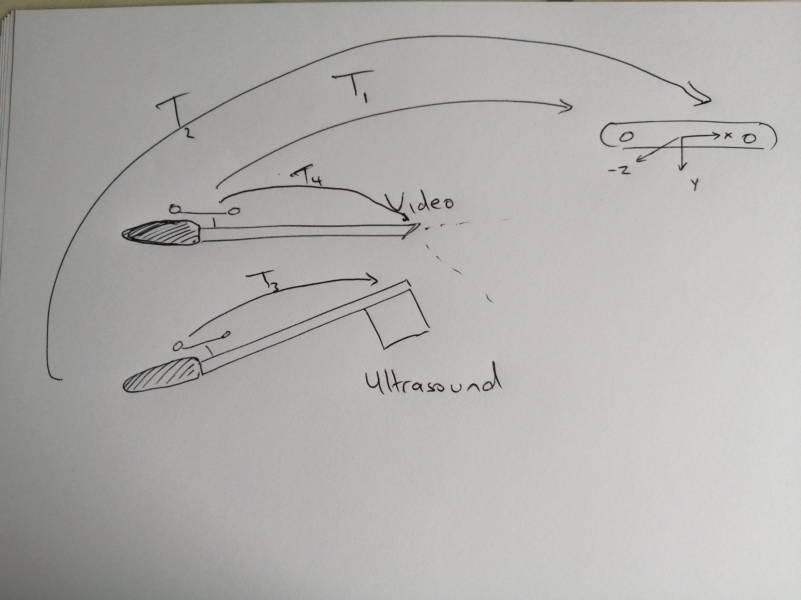
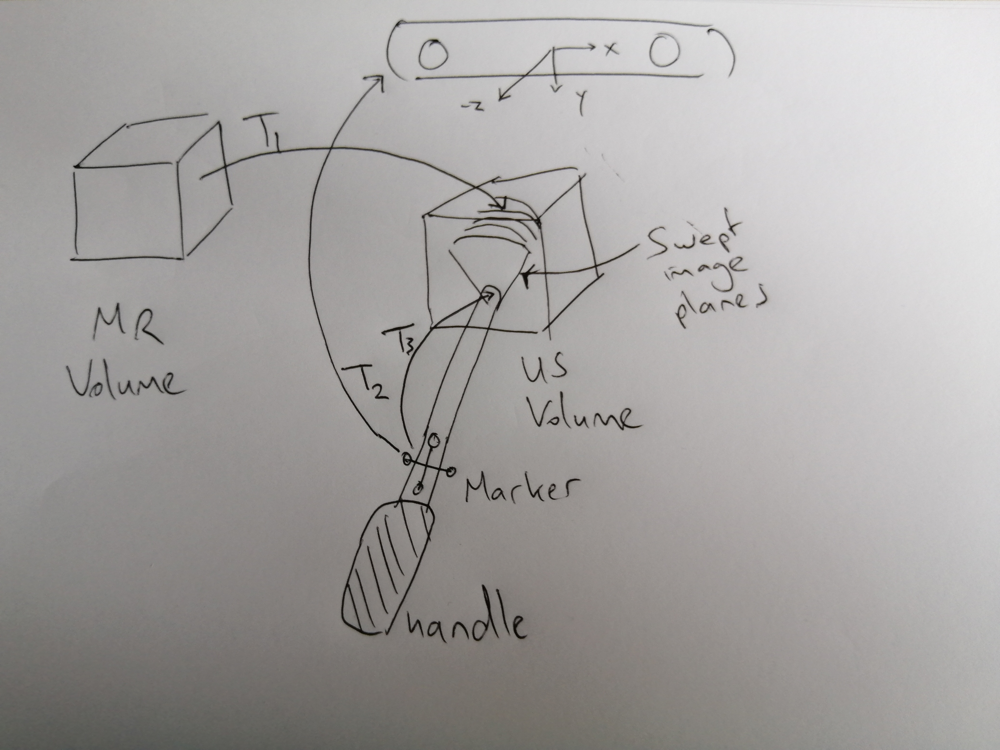

.. _SimulationWorkedExamples:

Worked Examples
===============

Setup
-----

First, make sure you have followed the :ref:`PythonSetup` instructions,
and specifically option 2, using ```tox```.

Notebooks
---------

In this course, we have the following Jupyter Notebooks as code examples:

* `How to run our notebooks <notebooks/running_notebooks.html>`_
* `Understand coordinate systems <notebooks/coordinate_systems.html>`_
* `A simple Point-Based Registration example <notebooks/point_based_registration.html>`_
* `How to simulate or understand the performance of optical tracking <notebooks/simulation_optical_tracking.html>`_
* `An example of a simulation of laparoscopic liver surgery <notebooks/lap_liver_sim.html>`_.
* To check your understanding, try completing this `TRE Worksheet <notebooks/TRE_Worksheet>`_.

These notebooks provide examples of different ways of simulating the performance of different components.


MATLAB Code
-----------

Most of the code in this course is expressed in Python. Here are is the start of
a set of links for MATLAB examples, should you need them.

* `Rigid Body Registration by Dr Yipeng Hu <https://github.com/YipengHu/matlab-common-tools/blob/master/SplineTransform/rigid_fit.m>`_.


What to Model?
--------------

For any given CAS system, it is worth drawing a system diagram, and deciding
which components to analyse, and whether to analyse components separately.

When a tracker is being used, we normally say that the world coordinate system is the same as
the tracking coordinate system.

In this section of the course, we are talking about *geometric modelling*,
as most of the current research literature is concerned with registration and
calibration accuracy? i.e. if we measure or predict the location of something,
how accurately can we determine a given location?

There will often be more than one way to mathematically model something. The examples
below provide options to illustrate this point. Sometimes your choice of 'what to
simulate' can be influenced by a clinicians perspective or an engineers perspective.


How to Measure TRE?
-------------------

The general idea of simulation is to first setup a geometrical scenario, where you artificially
construct a reasonable set of points, locations, device dimensions and so on, to
model your system. In such a scenario, you therefore know what the 'correct' location
of each point is, in each coordinate system. i.e. you have a gold standard.

When you are simulating, you either add noise to the location of tracked marker
points, or image coordinates, or even transformation parameters.

When you have added noise, you will have introduced error to the system,
that you can then take a known point in one coordinate system,
transform it to another coordinate system, and because of the noise you introduced,
the location will not match the gold standard 'correct' position. You can
then measure the error, and accumulate values to compute statistics such as TRE.


Worked Examples
---------------

[Kang2014]_: Laparoscopic Ultrasound and Laparoscopic Video
~~~~~~~~~~~~~~~~~~~~~~~~~~~~~~~~~~~~~~~~~~~~~~~~~~~~~~~~~~~



The example by Kang et al, includes:

* 2 tracking matrices, essentially determined by point-based registration from the tracking marker coordinate system to the
* 2 hand-eye calibration matrices determined by some calibration process
* To do augmented reality, we project an image plane onto the video image in the correct position, so you need camera intrinsics, camera extrinsics (stereo extrinsics) as well.


Options for geometric modelling include:

* Treat Laparoscope and LUS as separate, and model each like a pointer.

If you imagine you are trying to use a laparoscope and want to know the accuracy of a point in the
laparoscope camera coordinate system, you could just ignore projection geometry and focus on the
3D location. You could pick a representative point, e.g. 50cm from tracking marker, and assume that
the camera coordinate system is aligned with the marker coordinate system, therefore the hand-eye
transformation is just a translation of 50cm. Then you can treat the laparoscope like a pointer.

See: `How to simulate or understand the performance of optical tracking <notebooks/simulation_optical_tracking.html>`_

You could do similarly for the ultrasound. Effectively, this would give you two separate measures
for two separate devices. It would not include the effect of combining tracking errors.

* Estimate Errors of LUS location, over the imaging plane.

As the LUS image produces an image, each pixel in the image will be at a different distance
from the tracking marker at the handle. You could repeat the above process, for each point
in the image plane, and plot the results as an image of errors. This should indicate that
points further away from the handle, and further away from the rotational axis of the laparoscope
end up with more error.

* Combined LUS and Video simulation

The next level of increased difficulty might be to create a virtual point in the tracker coordinate system, and pretend
you had located it in the LUS image. Then multiply that point in LUS coordinates, by the relevant transformations
and convert it into a point in the laparoscope camera coordinates, and measure the difference from the gold standard.

* Variations in Hand-Eye Calibrations

You *could* try investigating the effects of noise on a calibration matrix. However, remember
from the :ref:`RegistrationIntro` lecture that you would need to convert your transformation
parameters (e.g. 3 euler angles, and 3 translations) to a 4x4 calibration matrix. Then
instead of adding noise to points, you would add an offset to the transformation parameters
themselves. You would have to define a suitable range (e.g. +/- 20mm or degrees) over which
to study the effects.

* Measurements in Pixels

The challenge with augmented reality apps is to draw things on the correct place on the screen.
This requires you to additionally project points from the 3D camera coordinate system, to the
2D image coordinate system, using the transformations learnt in the camera calibration lectures.

The above example, where you take a point in the LUS image, and project it onto the video image
requires a complete simulation of all system parameters. It is probably beyond the scope
of the coursework, but would definitely be worth doing if that is your area of research.

See: `An example of a simulation of laparoscopic liver surgery <notebooks/lap_liver_sim.html>`_.


[Hu2016]_: Freehand Ultrasound Prostate Biopsy
~~~~~~~~~~~~~~~~~~~~~~~~~~~~~~~~~~~~~~~~~~~~~~



This example by Hu et al includes

* Registration of MR to an intra-operative Ultrasound volume
* Calibration parameters to determine where each plane of the ultrasound is located in 3D space, as the 3D volume is made by using a mechanically swept 2D transducer
* A hand eye calibration to determine the position of the central 2D slice of the ultrasound volume, relative to the tracking marker
* A tracking transformation to determine the position of the tracking marker, relative to the tracker/world coordinate system.

As with the above example, there are several ways to study this system. Options include:

* Treat MR-to-US registration and the US probe as separate, and with the US probe as a pointer

Imagine that MR-to-LUS registration as a separate problem to tracking an ultrasound probe in space.
You could treat the MR to US registration problem as a stand-alone point-based-registration problem.
Either take an example 3D prostate image, or just simplify the prostate to a sphere of the right size. Then take 6 or so
landmarks round the edge, and pick a target point in the centre of the prostate. Construct
2 data-sets representing the points in the MR image, and the points in a corresponding US image.
You could just imagine that the US volume is directly translated along the negative z-axis of the tracker.
Then do point based registration of MR to Ultrasound to get your starting transformation, and the
position of the target point in the US volume.

Then imagine that once the MR is registered to the US 3D reference volume, the user is moving the
US probe around, and needs to locate a target point that is a certain distance from the
 US handle. This would then US probe analagous to a pointer.

See: `How to simulate or understand the performance of optical tracking <notebooks/simulation_optical_tracking.html>`_

* Or additionally asses the Hand-Eye calibration of US probe

A step more difficult would be to encorporate the hand-eye calibration into the simulation of the
ultrasound position. This would require picking a reasonable set of 3 rotations, 3 translations,
and creating a starting position, as shown above, and then picking a representative target point
in the ultrasound image plane. Then, if you transform the MR point to the tracker space, using
an example registration, you can calculate the gold standard or target point of reference in the tracker space,
and in the ultrasound image space. Thus, as you vary the hand-eye parameters, and/or the tracking parameters
you can either study the effects of noise in the tracking system, or the effect of miscalibration on TRE.


