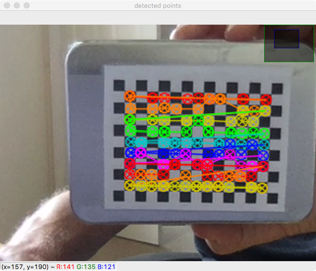

.. _SummerSchoolCameraCalibration:

Camera Calibration
==================

Introduction
------------

This is the `SciKit-Surgery`_ tutorial on video camera calibration.
It was developed as a 2 hour tutorial for online delivery during the 2020
`Medical Image Computing Summer School`_ hosted by UCL.
The concepts taught are very relevant to any video camera calibration scenario,
as found in computer assisted surgery, photogrammetry, computer vision and so on.

The tutorial is divided into five sections:

* Installation and familiarisation with the software (20 minutes)
* Understanding what a camera model is (40 minutes, mostly reading)
* Calibrate a webcam (20 minutes)
* Evaluate the accuracy of a calibration (20 minutes)
* Discussion and writing up results (20 minutes)

Learning Objectives
-------------------

After completing the tutorial students should be able to:

* Explain what is meant by camera calibration
* Be able to design a protocol to accurately calibrate a camera
* Be able to list common sources of error that cause poor calibration

Assumed Knowledge
-----------------

`SciKit-SurgeryBARD`_ is Python software, it is assumed that pupils have a working Python installation and are able to install packages.

Installation
------------

Follow the :ref:`PythonSetup` instructions, specifically using Option 2 of the installation instructions.

Activate You Environment
------------------------

If you've followed the :ref:`PythonSetup` instructions, you should have 'activated'
your python environment in the MPHY0026/.tox folder.

As a reminder, these are the commands that 'activate' the environment
when your current working direction is the top-level folder of the MPHY0026 repository.

::

    source .tox/test/bin/activate

or if you are a Windows user:

::

    .tox\test\Scripts\activate

This means that your terminal is running the python environment with all the
right libraries installed. So, make sure you have 'activated' the right environment
before continuing.

Related Tutorials
-----------------

This tutorial was designed to replace the video camera calibration session of the `BARD calibration tutorial`_,
to enable remote delivery when the students do not have access to a calibration target or a printer.

What is Camera Calibration?
---------------------------

"Geometric camera calibration", also called "camera resectioning" is the process of
selecting a suitable model that mimics the physical process of image formation,
and then determining the parameters of that model.

The name is often simplified to "camera calibration", but be aware that
people working in photogrammetry use this term to refer to photometric
camera calibration, which is used to map the colour values to standard scales.

For the remainder of this tutorial, we will use the term "camera calibration",
to refer to "geometric camera calibration".

For a simple overview, please read:

  - `Matlab Tutorial`_
  - `OpenCV Tutorial`_

Key take-home points:

  - The most common model, is the `Pinhole Camera Model`_, but others exist.
  - The most common formulation, `Zhang's method`_, models distortion parameters, and intrinsic parameters. It's commonly used because its easily accessible in MATLAB and OpenCV.
  - Distortion parameters can be used to remove tangential or radial distortion. See `OpenCV Tutorial`_ for illustrations.
  - The intrinsic parameters can then be used to map from 3D coordinates in front of the camera, to 2D pixel coordinates.
  - The reason to do all this, is so that the camera can be used to measure objects in real-world units (e.g. millimetres), or measure it's own position relative to other objects in real-world units (e.g. millimetres).

There are many examples on YouTube (search 'Camera Calibration').
However, most use an accurately printed calibration target.

The purpose of this tutorial, is to demonstrate camera calibration at home.

Calibrate Your Webcam
---------------------

In this section, we will calibrate a webcam. We envisage that most people can use
a laptop camera. If you have a USB webcam, it may be easier to position that. Or try both!

First choose a calibration target:

  - if you have a printer, download a `6mm calibration target`_ and print it, and attach it to something flat, e.g. old CD case.
  - or use your phone. Search google images for "camera calibration chessboard". Click on an image, display it as large as possible on your phone. Measure the size of the squares with a ruler. Ensure your energy saver settings don't dim the display too quickly.

Then, check you have the correct parameters set in the configuration file.

  - open ``doc/summerschool/camera_calibration/video_calib_chessboard.json`` in a text editor
  - Open CV detects 'internal corners', not the outer most ones. So, the grid show in the picture below is 9 x 6.

.. figure:: https://docs.opencv.org/2.4/_images/fileListImage.jpg
  :alt: OpenCV 9 x 6 grid
  :width: 600

  An `OpenCV calibration grid`_, from opencv.org, which is is BSD licensed, shows a 9 (wide) x 6 (high) grid, counting the internal corners.

  - Edit the config file to specify the "corners" and the "square size in mm" to match your chessboard.

The calibration program can now be run with the following command:

::

    bardVideoCalibration -c doc/summerschool/camera_calibration/video_calib_chessboard.json -o data/calibration -p calib

The -o and -p arguments are optional, for when you want to save your calibration results to disk:

  - 'c': config file location (required)
  - 'o': directory to save calibration results to.
  - 'p': filename prefix - Calibration generates ~30 files, which will all share a common prefix.

The calibration process is best explained via a video:

.. raw:: html

    <iframe width="560" height="315" src="https://www.youtube.com/embed/AAkuYGBV7GA" frameborder="0" allow="accelerometer; autoplay; encrypted-media; gyroscope; picture-in-picture" allowfullscreen></iframe>

Controls:

  - 'q': quit
  - 'c': capture an image

Helpful Hint
------------

Never use a symmetrical chessboard, or symmetrical calibration pattern.

All calibration software detects patterns, such as chessboard corners, in the captured 2D
images. If your image processing routine gets confused and for some pictures swaps rows and columns
in any way, you will get poor calibration results, and it's hard to spot!!!

Points must be uniquely identifiable.

Exercises
---------

Now you can calibrate your camera, you can perform many calibrations to get
a feel for various problems. Watch out for poorly captured points:

  This image shows an example of poorly (incorrectly) identified points.

If you see an image above, where the detected points are not in straight rows,
then the calibration must be repeated from scratch. Stop the program and start again.

  * Calibrate with 5 images, very close. What is the re-projection error?
  * Calibrate with 5 images, far away. Is the re-projection error better/worse? Or does it even work?
  * Dim the lights. Does the software detect the chessboard? If so, is the reprojection error better/worse?
  * What if you 'capture' an image, while your hand is moving/wobbling? Too much blur, and the software fails to detect. But what if it does detect points. Are they good points?
  * Try a calibration with all the images in much the same position. Occasionally, the underlying math fails.
  * Try a calibration encorporating rotations around 3 axes, translations in 3 axis, and ensuring that chessboards reach all 4 corners of the image.
  * What is a good protocol to get a low re-projection error?
  * If you do more and more calibration images, does the re-projection error improve? Does it ever get worse?
  * Do one calibration with increasing number of images. Plot a graph of re-projection error and triangulation error with increasing number of images.

You should now be in a position to describe how to accurately calibrate a video camera.

Write down a protocol, to hand-in.

  - how many images
  - how to move it?
  - what range?
  - etc.

How Good Is A Calibration?
--------------------------

The camera calibration process matches 3D chessboard coordinates to 2D image coordinates,
and minimises the sum-of-squares re-projection error. Therefore, the re-projection error
is a poor way to evaluate the quality of your calibration, as the re-projection error is
what was minimised during the calibration. Re-projection error also has the units of pixels, so is hard to interpret.

The bardVideoCalibration software also takes subsequent pairs of images in the calibration set and tries to triangulate
the position of the chessboard corners, measuring the error in 3D. The smaller the number
the better. The units are in millimetres, so at least it corresponds to a physically meaningful
measurement of error.

However, once calibrated, the camera should be able to be used as a measuring device.
So, in this section we will try to assess the quality of the calibration, measuring
actual physical movements. In other words, if we move the chessboard by 5mm, does
the camera measure the movement as a 5mm shift, or something else?

First, do a good calibration, saving the data to a specific folder:

::

    bardVideoCalibration -c doc/summerschool/camera_calibration/video_calib_chessboard.json -o <some_folder_name>

**N.B.** Keep note of where you have saved this data, and the contents of your config file, as you will re-use these later for the `Overlay`_ section.

Then, you can evaluate the quality of the registration using:

::

    bardVideoCalibrationChecker -c doc/summerschool/camera_calibration/video_calib_chessboard.json -d <some_folder_name> -p calib

where the '-d' option specifies the directory where you stored your calibration data in the step before.

Again, an overview of the software is best seen via a video:

.. raw:: html

    <iframe width="560" height="315" src="https://www.youtube.com/embed/4l2mi8_02LY" frameborder="0" allow="accelerometer; autoplay; encrypted-media; gyroscope; picture-in-picture" allowfullscreen></iframe>

Controls:

  - 'q': quit
  - 'c': capture
  - 't': measure translation difference
  - 'm': evaluate the mean/std dev of a fixed position.

Exercises
---------

So, given you can calibrate your camera, and assess the accuracy thereof, there are some
exercises for the reader:

  - Start the app, make sure the chessboard is in view, and that when you hit 'c' the chessboard is correctly detected
  - Restart the app
  - With the chessboard in view, press 'c', then press 'm' repeatedly. After 10 presses of the 'm' key, without moving the camera or the chessboard, you have the standard deviation of the x, y, z positional measurement.
  - Restart the app
  - Press 'c' once to capture the current position
  - move the chessboard by 5mm
  - Press 't' to measure the translation
  - Repeat, moving the chessboard by 5mm, and hitting 't' to evaluate the translation
  - Paste the translation numbers into a spreadsheet.
  - Compute the distance moved for each shift, to combine x, y, z translation into a distance (as the direction of movement it unlikely to be exactly aligned with the camera).
  - Compute the error for each shift, and then the Mean and Standard Deviation of the error.

  - Repeat this whole thing twice, using a 'good' and a 'bad' calibration. Are the calibrations discernibly different?

Write down the Mean and Standard deviation of the translation error, to hand in.

Hand-In
-------

You can email your results to Matt Clarkson, or upload the results to the MS Teams channel of the summer school.

 1. Your written protocol for calibrating a camera.
 2. You error measures for a good and bad calibration.

Caveat: The point of this tutorial is to illustrate the concepts. In practice,
with modern cameras being quite good, you may get surprisingly good results, and not be able
to adequately measure when you have a bad calibration!! Alternatively, the
practicalities of doing this at home might mean, you cannot move the camera
a sufficient distance, or sufficiently accurately, like you could do in the lab.

Your mileage may vary. Good luck.

Further Reading
---------------

The literature is vast. However, be sure you have read:

  - [Zhang2000]_

Further Work
------------

Here's some development suggestions:

  - For exercise sake, go through the `OpenCV Tutorial`_.
  - Program bardVideoCalibration, just calls a `SciKit-Surgery`_ app. Review `video_calibration_app.py`_ to see how it works.
  - The above app uses the calibration framework in `scikit-surgerycalibration`_, shown `in this folder`_.
  - The above mentioned folder does contain a lot of extra functionality, for mono, stereo and hand-eye calibration. The `unit tests` are a good place to start.

.. _`SciKit-Surgery`: https://github.com/UCL/scikit-surgery/wikis/home
.. _`SciKit-SurgeryBARD`: https://github.com/UCL/scikit-surgerybard
.. _`BARD calibration tutorial`: https://scikit-surgerybard.readthedocs.io/en/latest/02_1_Calibrate_Your_Camera.html
.. _`Medical Image Computing Summer School`: https://medicss.cs.ucl.ac.uk/
.. _`MPHY0026`: https://mphy0026.readthedocs.io/en/latest/
.. _`Matlab Tutorial`: https://www.mathworks.com/help/vision/ug/camera-calibration.html
.. _`OpenCV Tutorial`: https://medium.com/vacatronics/3-ways-to-calibrate-your-camera-using-opencv-and-python-395528a51615
.. _`Zhang's method`: http://dx.doi.org/10.1109/34.888718
.. _`Pinhole Camera Model`: https://en.wikipedia.org/wiki/Pinhole_camera_model
.. _`6mm calibration target`: https://github.com/UCL/scikit-surgerybard/blob/master/data/calibrationGrids/calibrationgrid-6mm.pdf
.. _`OpenCV calibration grid`: https://docs.opencv.org/2.4/_images/fileListImage.jpg
.. _`video_calibration_app.py`: https://github.com/UCL/scikit-surgerycalibration/blob/master/sksurgerycalibration/ui/video_calibration_app.py
.. _`scikit-surgerycalibration`: https://github.com/UCL/scikit-surgerycalibration
.. _`in this folder`: https://github.com/UCL/scikit-surgerycalibration/tree/master/sksurgerycalibration/video
.. _`unit tests`: https://github.com/UCL/scikit-surgerycalibration/tree/master/tests/video
.. _`Overlay`: https://mphy0026.readthedocs.io/en/latest/summerschool/overlay_demo.html
