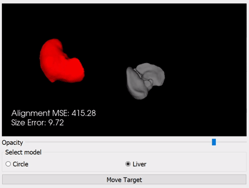

.. _SummerSchoolOverlay:

Overlay
=======

Overlaying data on a video feed is commonly used to:

* Present additional textual information to the user.
* Highlight areas of interest in the image.
* Implement augmented reality (AR)

.. raw:: html

    <iframe width="560" height="315" src="https://www.youtube.com/watch?v=zzcdPA6qYAU" frameborder="0" allow="accelerometer; autoplay; encrypted-media; gyroscope; picture-in-picture" allowfullscreen></iframe>

Head mounted systems for overlay, such as the Microsoft Hololens, allow for overlay directly in the user's field of view.

.. raw:: html

    <iframe width="560" height="315" src="https://www.youtube.com/embed/loGxO3L7rFE" frameborder="0" allow="accelerometer; autoplay; encrypted-media; gyroscope; picture-in-picture" allowfullscreen></iframe>

For surgical applications, specific use cases include:
* Drawing a region of interest around pertinent landmarks - tumors, arteries etc.
* Overlaying a 3D model of an organ which includes additional anatomical information that may not be visible on the video.
* Picture in picture ultrasound, so that a surgeon does not have to look between multiple screens.

Issue to consider
^^^^^^^^^^^^^^^^^
* Where to place the overlay data? Data should be conveniently located, but don't want to obscure the clincian's view.
* How is the AR model aligned to the real life view? Manual aligment is simple to implement, but can be difficult to orient properly for complex shapes (See exercise).
* Getting things to look 'real' is challenging.

Exercise
^^^^^^^^

**Prerequisites**

The example in this section requires Python, it is assumed that pupils have a working Python installation and are able to install packages. If this tutorial has been installed as part of the MPHY0026 module, then the required packages should already be present.

Running the overlay application will allow you to try manual alignment of 2D/3D objects. From the root MPHY0026 folder, run:
    
    python mphy0026_overlay.py 

Two cases are presented, a 2D alignment of a circle, and a more realistic example where a liver model needs to be alinged to a background shape.  

In each case, try to minimise both the size error and the alignment error. Alignment error considers both rotation and position.  

* Repeat the exercise multiple times (Press 'Move Target' to generate a new location).
* Does adjusting the opacity of the model make it easier/harder?
* How does 3D alignment compare to 2D aligment?
* What are the potential drawbacks of this approach for surgical applications?
* What can be considered a 'good' aligment?
* What type of user interface would be best for aligment?
