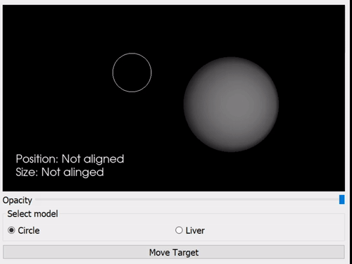
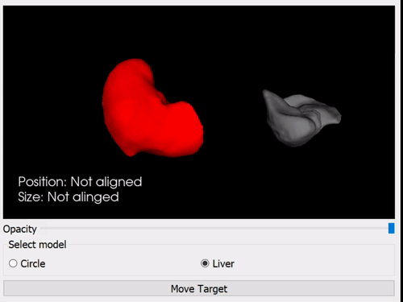

.. _SummerSchoolOverlay:

Overlay
=======

Overlaying data on a video feed is commonly used to:

* Present additional textual information to the user.
* Highlight areas of interest in the image.
* Implement augmented reality (AR)

.. raw:: html

    <iframe width="560" height="315" src="https://www.youtube.com/watch?v=zzcdPA6qYAU" frameborder="0" allow="accelerometer; autoplay; encrypted-media; gyroscope; picture-in-picture" allowfullscreen></iframe>

Head mounted systems for overlay, such as the Microsoft Hololens, allow for overlay directly in the user's field of view.

.. raw:: html

    <iframe width="560" height="315" src="https://www.youtube.com/embed/loGxO3L7rFE" frameborder="0" allow="accelerometer; autoplay; encrypted-media; gyroscope; picture-in-picture" allowfullscreen></iframe>

For surgical applications, specific use cases include:
* Drawing a region of interest around pertinent landmarks - tumors, arteries etc.
* Overlaying a 3D model of an organ which includes additional anatomical information that may not be visible on the video.
* Picture in picture ultrasound, so that a surgeon does not have to look between multiple screens.

Challenges
^^^^^^^^^^
* Where to place the overlay data? Data should be conveniently located, but don't want to obscure the clincian's view.
* How is the AR model aligned to the real life view? Manual aligment is simple to implement, but can be difficult to orient properly for complex shapes (See exercise).
* Getting things to look 'real' is challenging.

Exercise
^^^^^^^^

Running the overlay application will allow you to try manual alignment of 2D/3D objects.
Two cases are presented, a 2D alignment of a circle, and a more realistic example where a liver model needs to be alinged to a background shape. Some margin of error is allowed for, so the two objets do not have to match perfectly.

    python mphy0026_overlay.py

Questions
^^^^^^^^^

* Does adjusting the opacity of the model make it easier/harder?
* How does 3D alignment compare to 2D aligment?
* What are the potential drawbacks of this approach for surgical applications?
