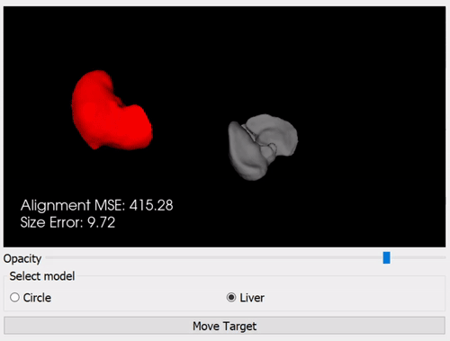
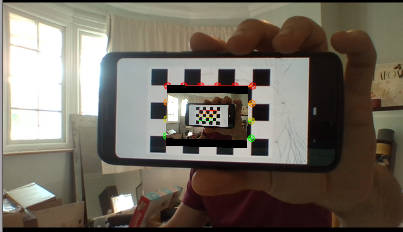
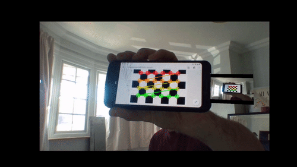

.. _SummerSchoolOverlay:

Augmented Reality (AR) Overlay
==============================

Introduction
------------

This is the `SciKit-Surgery`_ tutorial on augmented reality image overlay.
It was developed as a tutorial for online delivery during the 2020
`Medical Imaging Computing Summer School`_ hosted by UCL.

The tutorial is divided into four sections:

* Background material (30 mins)
* Exercise 1 - 3D Model Alignment (15 minutes)
* Exercise 2 - 3D & 2D overlay on video feed (15 minutes)
* Exercise 3 - AR Demo (10 minutes)

Learning Objectives
-------------------

After completing this tutorial, students should be able to:

* Describe common uses of image overlay in medical imaging.
* Describe common challenges of image overlay in medical imaging.
* Explain the advantages/disadvantages of overlaying 2D & 3D data.

Assumed Knowledge
-----------------

It is assumed that pupils have a working Python installation and are able to install packages.
If this tutorial has been installed as part of the `MPHY0026`_ module, then the required packages should already be present.

Background
----------

Overlaying data on a video feed is commonly used to:

* Present additional textual information to the user.
* Highlight areas of interest in the image.
* Implement augmented reality (AR)

.. raw:: html

    <iframe width="560" height="315" src="https://www.youtube.com/embed/zzcdPA6qYAU" frameborder="0" allow="accelerometer; autoplay; encrypted-media; gyroscope; picture-in-picture" allowfullscreen></iframe>

    Illustration of text overlay on a video image, taken from the Terminator movies.

Head mounted systems for overlay, such as the Microsoft Hololens, allow for overlay directly in the user's field of view.

.. raw:: html

    <iframe width="560" height="315" src="https://www.youtube.com/embed/loGxO3L7rFE" frameborder="0" allow="accelerometer; autoplay; encrypted-media; gyroscope; picture-in-picture" allowfullscreen></iframe>

    Illustration of proposed medical application of Microsoft Hololens see through head up display.

For surgical applications, specific use cases include:

* Drawing a region of interest around pertinent landmarks - tumors, arteries etc.
* Overlaying a 3D model of an organ which includes additional anatomical information that may not be visible on the video.
* Picture in picture ultrasound, so that a surgeon does not have to look between multiple screens.

Issue to consider
-----------------

* Where to place the overlay data? Data should be conveniently located, but don't want to obscure the clincian's view.
* How is the AR model aligned to the real life view? Manual alignment is simple to implement, but can be difficult to orient properly for complex shapes (See exercise).
* Getting things to look 'real' is challenging.

Additional information
----------------------

Further learning material can be found in the following sections of this course.

* `Augmented Reality`_ - examples of different systems and use cases.
* `Graphics`_ - Techcnical details on different rendering methods and algorithms.

Exercise 1
----------

Running the overlay application will allow you to try manual alignment of 2D/3D objects. From the root MPHY0026 folder, run:

::

    python mphy0026_overlay.py 

Two cases are presented, a 2D alignment of a circle, and a more realistic example where a liver model needs to be aligned to a background shape.

In each case, try to minimise both the size error and the alignment error. Alignment error in this case in an arbitrary measure that considers both rotation and position.  

* Repeat the exercise multiple times (Press 'Move Target' to generate a new location).
* Does adjusting the opacity of the model make it easier/harder?
* How does 3D alignment compare to 2D aligment?
* What are the potential drawbacks of this approach for surgical applications?
* What can be considered a 'good' aligment?
* What type of user interface would be best for aligment?

Exercise 2
----------

The next application shows a more realistic use case, where we want to overlay 3D and 2D data on the same scene. A webcam is required for this section.

::

    python mphy0026_slice_overlay.py

Here, we overlay a 3D model of an artificial skull, along with 2D slice data taken along a plane of the volume, on a video feed.
The two sliders can be used to control the position of the 2D slice. The model/slice views can be toggled on/off.

.. image:: overlay/slice_overlay.gif

* Try to overlay the model on your own head/a friend.
* What are the potential drawbacks of this approach for surgical applications?
* Which of the two views - 3D or 2D, do you think could provide the most useful information to a surgeon?

Exercise 3
^^^^^^^^^^

The final application will demonstrate a more realistic use case, where we will combine some of the work done in previous chapters, to visualise our own 'probe'.
This exercise requires you to have completed the `Camera Calibration`_ workshop, and have access to the config file and saved calibration data.

Using a calibrated camera and a chessboard, it is possible to estimate the pose (position & orientation) of an object in 3D space. We can use this pose information to overlay
data in the correct position in 3D space:

    python mphy0026_slice_overlay.py -c doc/summerschool/camera_calibration/video_calib_chessboard.json -d CALIB_DIR

Here, we have overlaid the video feed back onto the chessboard pattern. As you move/rotate the chessboard, the overlay should remain in the same position.

An application of this approach would be to display ultrasound information eminating from the tip of an ultrasound probe. We can emulate this by imagining that the probe tip is
located at the edge of the mobile phone. To do this correctly, it is necessary to know the location of the probe tip (phone edge), relative to the tracking markers (chessboard).
In practice, this would be acheived using an appropriate calibration method (e.g. pivot or hand-eye calibration). For now, we can simply specify the distance that the image should
be offset from the chessboard centre, as a command line arugment:

    python mphy0026_slice_overlay.py -c doc/summerschool/camera_calibration/video_calib_chessboard.json -d CALIB_DIR -o 90

I have used an offset value of 90, but you should adjust this value to get the best results on whichever phone/chessboard you are using.

.. _`SciKit-Surgery`: https://github.com/UCL/scikit-surgery/wikis/home
.. _`Medical Imaging Computing Summer School`: https://medicss.cs.ucl.ac.uk/
.. _`MPHY0026`: https://mphy0026.readthedocs.io/en/latest/
.. _`Augmented Reality`: https://mphy0026.readthedocs.io/en/latest/augmented/augmented_reality.html
.. _`Graphics`: https://mphy0026.readthedocs.io/en/latest/graphics/graphics.html
.. _`Camera Calibration`: https://mphy0026.readthedocs.io/en/latest/summerschool/camera_calibration_demo.html