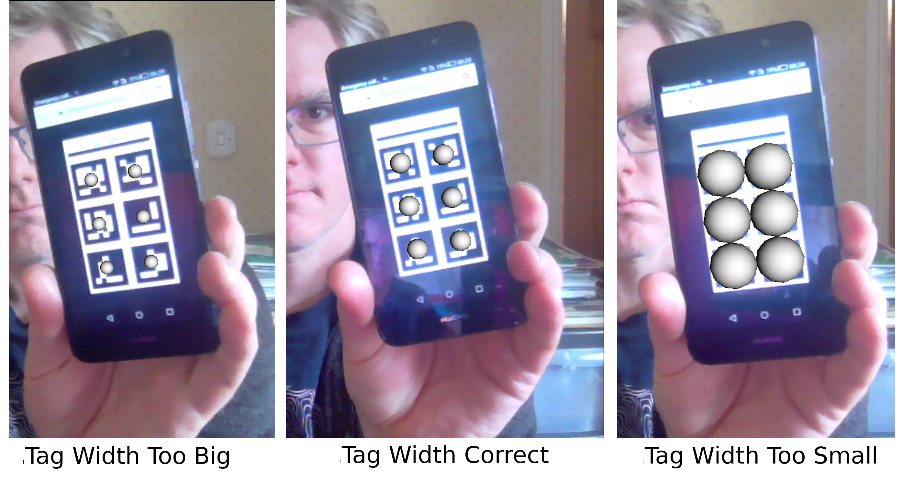

.. _SummerSchoolPivotCalibration:

Make and Calibrate a Pointer 
============================

Introduction
------------

This is the `SciKit-Surgery`_ tutorial on making a tracked pointer and the 
calibration of the pointer. 
It was developed as a two hour tutorial for online delivery during the 2020
`Medical Imaging Summer School`_ hosted by UCL. Tracked pointers are an essential
tool for image guided interventions, but are useful in a variety of 
applications

The tutorial makes used the Python application `SciKit-SurgeryBARD`_

The tutorial is divided into four sections:

* Introduction to tracked pointers (10 mins)
* Introduction to ArUco markers and assembling your pointer (20 mins)
* Calibration of your pointers (40 mins)
* Estimating calibration and tracking accuracy (30 minutes)
* Discussion and writing up results (20 minutes)

Learning Objectives
^^^^^^^^^^^^^^^^^^^

After completing the tutorial students should be able to:

* Describe how a tracked pointer can be used during image guided surgery.
* Demonstrate the use ArUco marker to track an object using SciKit-SurgeryBARD
* Perform a pivot calibration using SciKit-SurgeryBARD
* Estimate the accuracy of the calibrated tracked pointer.

Assumed Knowledge
^^^^^^^^^^^^^^^^^

`SciKit-SurgeryBARD`_ is Python software, it is assumed that pupils have a working Python installation and are able to install packages. If this tutorial has been installed as part of the `MPHY0026`_ module, then `SciKit-SurgeryBARD`_ should have already been installed. If not you should be able to install `SciKit-SurgeryBARD`_ using:

::

    pip install scikit-surgerybard

and the source code installed with

::

    git clone https://github.com/UCL/scikit-surgerybard

Related Tutorials
^^^^^^^^^^^^^^^^^

This tutorial was designed to replace the make your own pointer session of the `SciKit-SurgeryBARD`_ tutorial, to enable remote delivery when the students do not have access to a suitable phantom or printer. In also incorporates parts of the `Pivot Calibration with RANSAC`_ tutorial from the `MPHY0026`_ module.

Part 1 Introduction to Tracked Pointers
---------------------------------------

Tracked pointers enable the user to locate points and surfaces relative to the tracking system. 
Their main use for image guided surgery is to locate fiducial markers for use in `point based registration`_ or to digitise surfaces for `surface based registration`_. More generally they can be
used to make measurements and localise anatomy. 

Tracked pointers consist of three parts. 

* The tip, this is the bit that makes contact with the patient or fiducial marker. It must enable a unique point to be picked, so is often pointed so the tip is unambiguous. However it may also be spherical, so when inserted into a fiducial marker with a spherical divot the centre of the sphere is uniquely identifiable. For surgical applications the tip should be sterile.
* The tracker marker. This is the part that is tracked by the tracking system, e.g. and electromagnetic coil or the reflective spheres used in optical tracking systems.
* The frame and handle. In general it is not possible to place the tracking markers at the tip, so some sort of frame is needed to rigidly connect them. This frame can be designed also act as a handle for the user.

Have a quick look at some of the videos on the linked (above) registration pages, and observe the types of pointers they use.

Part 2 Introduction to ArUco markers and assembling your pointer
----------------------------------------------------------------

This tutorial is designed to be carried out away from the operating theatre so 
we'll make our own tracked pointer using (hopefully) readily available materials. 

For the tip you'll need something with a point, previously we have used pens, for 
today's demo I found a metal skewer which has the benefit of not leaving pen marks.

For the tracking system we'll use OpenCV's implementation of the `ArUco`_ tracking 
library which requires only a calibrated webcam or mobile phone camera and 
the ability to print markers or show them on a screen. Figure 1 shows the
tags we will use for tracking the pointer. You can print them out from the `printer ready pdf`_
and glue them to something rigid (cardboard etc), 
or you can display them on your mobile phone screen using the 
QR tag (Figure 2).

.. figure:: https://github.com/UCL/scikit-surgerybard/raw/master/data/pointer_withscale.png
  :width: 20%

  Figure 1: The patten of six unique tags we will use for pointer tracking. 

.. figure:: https://github.com/UCL/scikit-surgerybard/raw/master/data/qrtags/pointer_qr.png
  :width: 20%
  
  Figure 2: Scan this with your phone to open the tag image.

The ArUco tracking library relies on using computer vision to detect the 
corners of uniquely identifiable tags in a single frame of video. The position of the
tag relative to the camera can then be calculated using camera relative to the tag then be calculated 
via the `perspective n point`_ problem, implemented in `OpenCV`_. Solving this requires the 
tag corners in 3D space, which are defined in the file `pointer.txt`_. The first column of 
pointer.txt defines the uniquely identifiable tag ID. The remaining 15 columns are the x,y,z 
coordinates of the tag centre and four corners, as shown here:

::

  #tag id   #centre (x,y,z) #corner0 (x,y,z)     #corner1 (x,y,z) #corner2 (x,y,z) #corner3 (x,y,z)
  208	    -17.5	-8.75	0	-24.75	-16	0	-10.25	-16	0	-10.25	-1.5	0	-24.75	-1.5	0
  295	    0	-8.75	0	-7.25	-16	0	7.25	-16	0	7.25	-1.5	0	-7.25	-1.5	0
  365	    17.5	-8.75	0	10.25	-16	0	24.75	-16	0	24.75	-1.5	0	10.25	-1.5	0
  31	    -17.5	8.75	0	-24.75	1.5	0	-10.25	1.5	0	-10.25	16	0	-24.75	16	0
  1	0	    8.75	0	-7.25	1.5	0	7.25	1.5	0	7.25	16	0	-7.25	16	0
  757	    17.5	8.75	0	10.25	1.5	0	24.75	1.5	0	24.75	16	0	10.25	16	0

When you start SciKit-SurgeryBARD you need to define identify pointer.txt in the `config.json`_ file, shown below. 

::

  {
    "camera": {
        "source": 0,
        "width": 640,
        "height": 480,
        "grab": 33,
        "clock": 15,
        "fullscreen": false,
        "calibration" : "data/calibration.npz"
    },

    "pointerData": {
        "pointer_tag_file": "data/pointer.txt",
        "tag_width" : 32
    },

    "out path" : "pointer_positions"
  }

Ignoring the camera section, which is covered in the `camera calibration tutorial`_, we see that the pointer tag file is defined with the "pointer_tag_file" entry. Underneath that is "tag_width". If you printed your tags out 
they should be 32 mm wide, however if you are using a screen to show your tags it may be harder to control the tag width. Looking at Figure 1 you'll notice the horizontal line above the tags. You can measure the length of this line on your screen and enter the length into the configuration file. This enables to scale your tags without having to change `pointer.txt`_.

If you run SciKit-SurgeryBARD now with something like

::

    scikit-surgerybard -c config/pointer_markers.json

you should be able that the tags are being tracked by the presence of silver spheres overlaid on the 
tag centres, something like Figure 3. Double check that you've set tag_width right, an incorrect value will make the next step (calibration) very difficult.

  
  Figure 3: If the pointer tags are being tracked you should see silver spheres overlaid on the tags. Here the tag width was measured at 38 mm. If you set tag_width incorrectly in the configuration file the tags will still track, however if you set it too high (58 mm here) the tracker will locate the tags further away than they really are (small spheres at left), similarly if you set it too small (e.g. 18 mm) the spheres will appear closer (thus larger) than they should be.

Assembly of Your Tracker
^^^^^^^^^^^^^^^^^^^^^^^^

Now you're tracking your markers, assemble the pointer to your tracker markers. I've used gaffer tape to stick a skewer the back of my phone (Figure 4). It is important that the assembly is rigid, you do not want the pointer tip to move relative to the markers.

.. figure:: pivot_calibration/pointer.png
  :width: 80%

  Figure 4: The assembled tracked pointer.

Part 2 Calibration
------------------

The final stage in building your pointer is to determine the position of the pointer tip relative to the tracking markers. We refer to this as pivot calibration. The most commonly used calibration is pivot calibration, where the tip of pointer is held stationary and the body of the pointer is pivoted about this fixed point. 

Acquiring Data for Calibration
^^^^^^^^^^^^^^^^^^^^^^^^^^^^^^

Watch the video below for a demonstration of how to use SciKit-SurgeryBARD to acquire a set of marker poses to use for calibration.

.. raw:: html

  <iframe width="560" height="315" src="https://www.youtube.com/embed/1Y6xA-ezXds" frameborder="0" allow="accelerometer; autoplay; encrypted-media; gyroscope; picture-in-picture" allowfullscreen></iframe>

Acquiring marker poses for calibration amounts to pivoting the pointer through a cone of around 60 degrees while pressing 'd' in the SciKit-SurgeryBARD window. If it's not already there you need to add the following to your configuration file to tell SciKit-SurgeryBARD to turn on keyboard interaction. 

::
    
    "interaction": {
	  "keyboard" : true
    },

You should aim to capture at least 20 poses, around 100 would be ideal, but is important to try and spread them evenly around the imaginary cone coming up from the pivot point.

Performing Pivot Calibration
^^^^^^^^^^^^^^^^^^^^^^^^^^^^

.. _`SciKit-Surgery`: https://github.com/UCL/scikit-surgery/wikis/home
.. _`Medical Imaging Summer School`: https://medicss.cs.ucl.ac.uk/
.. _`MPHY0026`: https://mphy0026.readthedocs.io/en/latest/
.. _`SciKit-SurgeryBARD`: https://scikit-surgerybard.readthedocs.io/en/latest/02_4_Register_And_Ovelay.html
.. _`Pivot Calibration with RANSAC`: https://mphy0026.readthedocs.io/en/latest/notebooks/RANSAC.html
.. _`point based registration`: https://mphy0026.readthedocs.io/en/latest/registration/point_based_registration.html
.. _`surface based registration`: https://mphy0026.readthedocs.io/en/latest/registration/surface_based_registration.html
.. _`printer ready pdf`: https://github.com/UCL/scikit-surgerybard/raw/master/data/resources.pdf
.. _`ArUco`: https://docs.opencv.org/trunk/d5/dae/tutorial_aruco_detection.html
.. _`perspective n point`: https://en.wikipedia.org/wiki/Perspective-n-Point
.. _`OpenCV`: https://docs.opencv.org/2.4/modules/calib3d/doc/camera_calibration_and_3d_reconstruction.html#solvepnp
.. _`pointer.txt`: https://github.com/UCL/scikit-surgerybard/raw/master/data/pointer.txt
.. _`config.json`: https://github.com/UCL/scikit-surgerybard/raw/master/config/pointer_markers.json 
.. _`camera calibration tutorial`: https://mphy0026.readthedocs.io/en/latest/summerschool/camera_calibration_demo.html
