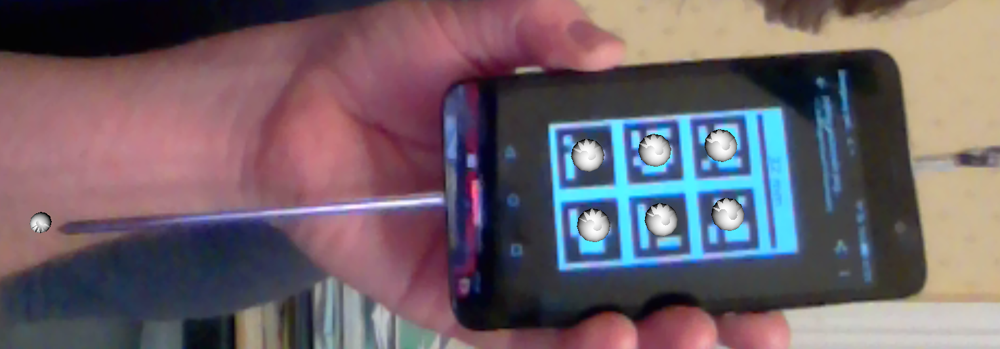

.. _SummerSchoolPivotCalibration:

Make and Calibrate a Pointer 
============================

Introduction
------------

This is the `SciKit-Surgery`_ tutorial on making a tracked pointer and the 
calibration of the pointer. 
It was developed as a two hour tutorial for online delivery during the 2020
`Medical Image Computing Summer School`_ hosted by UCL. Tracked pointers are an essential
tool for image guided interventions, but are useful in a variety of 
applications.

The tutorial makes use of the Python application `SciKit-SurgeryBARD`_

The tutorial is divided into four sections:

* Introduction to tracked pointers (10 mins)
* Introduction to ArUco markers and assembling your pointer (20 mins)
* Calibration of your pointers (40 mins)
* Estimating calibration and tracking accuracy (30 minutes)
* Discussion and writing up results (20 minutes)

Learning Objectives
-------------------

After completing the tutorial, students should be able to:

* Describe how a tracked pointer can be used during image guided surgery.
* Demonstrate the use of ArUco markers to track an object using SciKit-SurgeryBARD.
* Perform a pivot calibration using SciKit-SurgeryBARD.
* Estimate the accuracy of the calibrated tracked pointer.

Assumed Knowledge
-----------------

`SciKit-SurgeryBARD`_ is Python software, it is assumed that pupils have a working Python installation and are able to install packages.

Installation
------------

Follow the :ref:`PythonSetup` instructions, specifically using Option 2 of the installation instructions.

Activate You Environment
------------------------

If you've followed the :ref:`PythonSetup` instructions, you should have 'activated'
your python environment in the MPHY0026/.tox folder.

As a reminder, these are the commands that 'activate' the environment
when your current working direction is the top-level folder of the MPHY0026 repository.

::

    source .tox/py36/bin/activate

or if you are a Windows user:

::

    .tox\py36\Scripts\activate

This means that your terminal is running the python environment with all the
right libraries installed. So, make sure you have 'activated' the right environment
before continuing.

Related Tutorials
-----------------

This tutorial was designed to replace the "make your own" pointer session of the `SciKit-SurgeryBARD`_ tutorial,
to enable remote delivery when the students do not have access to a suitable phantom or printer.
It also incorporates parts of the `Pivot Calibration with RANSAC`_ tutorial from the `MPHY0026`_ module.

Part 1 Introduction to Tracked Pointers
---------------------------------------

Tracked pointers enable the user to locate points and surfaces relative to the tracking system. 
Their main use for image guided surgery is to locate fiducial markers for use in `point based registration`_
or to digitise surfaces for `surface based registration`_. More generally they can be
used to make measurements and localise anatomy. 

Tracked pointers consist of three parts. 

* The tip, this is the bit that makes contact with the patient or fiducial marker. The pointer must enable a unique physical point to be located, so the pointer is often pointed so the tip location is unambiguous. However it may also be spherical, so when inserted into a fiducial marker with a spherical divot the centre of the sphere is uniquely identifiable. For surgical applications the tip should be sterilisable.
* The tracker marker. This is the part that is tracked by the tracking system, e.g. an electromagnetic coil or the reflective spheres used in optical tracking systems.
* The frame and handle. In general it is not possible to place the tracking markers at the tip, so some sort of frame is needed to rigidly connect them. This frame can be designed to also act as a handle for the user.

Have a quick look at some of the videos on the linked (above) registration pages, and observe the types of pointers they use.

Part 2 Introduction to ArUco markers and assembling your pointer
----------------------------------------------------------------

This tutorial is designed to be carried out away from the operating theatre so 
we'll make our own tracked pointer using (hopefully) readily available materials. 

For the tip you'll need something with a point, previously we have used pens, for 
today's demo I found a metal skewer which has the benefit of not leaving pen marks.

For the tracking system we'll use OpenCV's implementation of the `ArUco`_ tracking 
library which requires only a calibrated webcam or mobile phone camera and 
the ability to print markers or show them on a screen. :numref:`reg_pointerwithscale` shows the
tags we will use for tracking the pointer. You can print them out from the `printer ready pdf`_
and glue them to something rigid (cardboard etc), 
or you can display them on your mobile phone screen using the 
QR tag (:numref:`reg_pointerqr`).

.. _reg_pointerwithscale:
.. figure:: https://github.com/UCL/scikit-surgerybard/raw/master/data/pointer_withscale.png
  :width: 20%

  The patten of six unique tags we will use for pointer tracking. 

.. _reg_pointerqr:
.. figure:: https://github.com/UCL/scikit-surgerybard/raw/master/data/qrtags/pointer_qr.png
  :width: 20%
  
  Scan this with your phone to open the tag image.

The ArUco tracking library relies on using computer vision to detect the 
corners of uniquely identifiable tags in a single frame of video. The position of the
tag relative to the camera can then be calculated using
the `perspective n point`_ algorithm, implemented in `OpenCV`_. Solving this requires the
tag corners in 3D space, which are defined in the file `pointer.txt`_. The first column of 
pointer.txt defines the uniquely identifiable tag ID. The remaining 15 columns are the x,y,z 
coordinates of the tag centre and four corners, as shown here:

::

  #tag id   #centre (x,y,z) #corner0 (x,y,z)     #corner1 (x,y,z) #corner2 (x,y,z) #corner3 (x,y,z)
  208	    -17.5	-8.75	0	-24.75	-16	0	-10.25	-16	0	-10.25	-1.5	0	-24.75	-1.5	0
  295	    0	-8.75	0	-7.25	-16	0	7.25	-16	0	7.25	-1.5	0	-7.25	-1.5	0
  365	    17.5	-8.75	0	10.25	-16	0	24.75	-16	0	24.75	-1.5	0	10.25	-1.5	0
  31	    -17.5	8.75	0	-24.75	1.5	0	-10.25	1.5	0	-10.25	16	0	-24.75	16	0
  1	0	    8.75	0	-7.25	1.5	0	7.25	1.5	0	7.25	16	0	-7.25	16	0
  757	    17.5	8.75	0	10.25	1.5	0	24.75	1.5	0	24.75	16	0	10.25	16	0

SciKit-SurgeryBARD uses a configuration file to set various parameters and the location of the pointer.txt file. You can download a suitable file here (`config.json`_) or copy and paste from below.

::

    {
    "camera": {
        "source": 0,
        "window size": [640, 480],
        "calibration directory": "data/example_camera_calib"
    },
    "tracker":{
        "type" : "sksaruco",
        "rigid bodies" : [
             {
                 "name" : "modelreference",
                 "filename" : "data/reference.txt",
                 "aruco dictionary" : "DICT_ARUCO_ORIGINAL"
             },
             {
                  "name" : "pointerref",
                  "filename" : "data/pointer.txt",
                  "aruco dictionary" : "DICT_ARUCO_ORIGINAL",
                  "tag_width" : 32
             }
            ]
    },

    "interaction": {
        "keyboard": true
    },
    "out path" : "pointer_positions"
    }

You will need to change the camera section, based on your results from the `camera calibration tutorial`_. Check that the window size matches the images you used for calibration, which should have been saved as png images in the calibration directory. The pointer tag file is defined with the "pointer_tag_file" entry.
Underneath that is "tag_width". If you printed your tags out 
they should be 32 mm wide, however if you are using a screen to show your tags it may be harder to control the tag width. Looking at :numref:`reg_pointerwithscale` you'll notice the horizontal line above the tags. You can measure the length of this line on your screen and enter the length into the configuration file. This enables to scale your tags without having to change `pointer.txt`_.

If you run SciKit-SurgeryBARD now with;

::

    sksurgerybard -c config.json

you should be able to see that the tags are being tracked by the presence of silver spheres overlaid on the
tag centres, something like :numref:`reg_pointer_tracking`. Double check that you've set tag_width right, an incorrect value will make the next step (calibration) very difficult.

.. _reg_pointer_tracking:
.. figure:: pivot_calibration/pointer_tracking.png
  :width: 100%
  
  If the pointer tags are being tracked you should see silver spheres overlaid on the tags. Here the tag width was measured at 38 mm. If you set tag_width incorrectly in the configuration file the tags will still track, however if you set it too high (58 mm here) the tracker will locate the tags further away than they really are (small spheres at left), similarly if you set it too small (e.g. 18 mm) the spheres will appear closer (thus larger) than they should be.

Assembly of Your Tracker
------------------------

Now you're tracking your markers, assemble the pointer to your tracker markers. I've used gaffer tape to stick a skewer to the back of my phone ( :numref:`reg_ass_pointer` ). It is important that the assembly is rigid, you do not want the pointer tip to move relative to the markers.

.. _reg_ass_pointer:
.. figure:: pivot_calibration/pointer.png
  :width: 80%

  The assembled tracked pointer.

Part 3 Calibration
------------------

The final stage in building your pointer is to determine the position of the pointer tip relative to the tracking markers. We refer to this as the pointer's calibration. One method for finding the tip position is pivot calibration, where the tip of pointer is held stationary and the body of the pointer is pivoted about this fixed point. 

Acquiring Data for Calibration
------------------------------

Watch the video below for a demonstration of how to use SciKit-SurgeryBARD to acquire a set of marker poses to use for calibration.

.. raw:: html

  <iframe width="560" height="315" src="https://www.youtube.com/embed/AOdwEA-zdh4" frameborder="0" allow="accelerometer; autoplay; encrypted-media; gyroscope; picture-in-picture" allowfullscreen></iframe>

Acquiring marker poses for calibration amounts to pivoting the pointer through a cone of around 60 degrees while pressing 'd' in the SciKit-SurgeryBARD window. If it's not already there you need to add the following to your configuration file to tell SciKit-SurgeryBARD to turn on keyboard interaction. 

::
    
    "interaction": {
	  "keyboard" : true
    },

You should aim to capture at least 20 poses, around 100 would be ideal, but is important to try and spread them evenly around the imaginary cone coming up from the pivot point.

Performing a Pivot Calibration
------------------------------

Performing the pivot calibration involves finding the offset between the measured marker positions and the unknown tip position such that the pointer tip is stationary. SciKit-SurgeryBARD currently implements two algorithms to find the offset. These are "Algebraic one step", "sphere fitting" which are described in `Yanniv 2015`_. In addition the algebraic one step method can be used on conjunction with `RANSAC`_ to remove outliers from the optimisation. Try running:

:: 

    bardPivotCalibration -i pointer_positions/bard_pointer_matrices/

You should see output like:

::

    Pointer Offset =  [[-180.34596358   -2.65290744    2.35962519]]
    Pivot Location =  [[-125.67858276  108.98254023  369.15847379]]
    Residual Error =  9.914944136259292

The pointer offset is the position of the pointer tip relative to the marker pattern, this is what we're trying to find. The pivot location is the location of the pivot relative to the tracking camera (the webcam). It is useful to compare this with your physical setup as it can give a quick indication of whether things have worked correctly. Looking at last value we see that the pivot location was about 37 cm from the camera. That seems about right given what we see in the video above. The last value is the residual error, which gives a measure of the spread of pointer tips around the estimated pivot location. 

By default bardPivotCalibration.py uses the algebraic one step method. You can change this by supplying a configuration file with the -c command line flag. Create configuration file like this `for sphere fitting`_ 

::

  {
	 "method" : "sphere_fitting",
	 "init_parameters" : [-800, -90, -2000, 300]
  }   

and like this `for RANSAC`_

::
    
  { 
	"method": "ransac",
	"number_iterations" : 10,
	"error_threshold" : 4,
	"consensus_threshold" : 0.25
  }

then rerun pivot calibration with your configuration file. 

::

    bardPivotCalibration -i pointer_positions/bard_pointer_matrices/ -c your_config.json

What happens? It is likely you'll need to change in the initial parameters for sphere fitting. The first three parameters are the estimated pivot location, and the last is the sphere radius. You could use the output from the algebraic one step method for this.

If time permits repeat this process (acquisition and calibration) several times and save your results in separate directories. How much do the results vary? What happens to the residual errors?

Part 4 Estimating Calibration Error
-----------------------------------

Knowing how accurately your pointer can locate things if very important for image guided surgery. This localisation accuracy forms the main part of Fiducial Localisation Error which will be covered in greater detail in the `registration tutorial`_. 

Start by picking one of your registrations and copying the pointer tip position into a pointer_tip.txt file like:

:: 

    -180.34596358   -2.65290744    2.35962519

Then add "pointer_tag_to_tip" entry to the BARD configuration file like:

::

    "pointer": {
        "pointer_tag_to_tip": "data/pointer_tip.txt"
    },

Now run SciKit-SurgeryBARD with;

::

    sksurgerybard -c config.json

When your tags are visible you should now see an extra sphere, somewhere near the tip of the pointer.

.. _reg_pointer:

  Tracked pointer with tip. Note the additional sphere at the left hand side showing the estimated position of the pointer tip.

At this point the you may notice that the sphere marking the pointer tip is very jittery. This due to the 
small tracking errors at the markers being magnified by the lever arm of the pointer. A longer pointer should
be more jittery. You can reduce the jitter by adding some tracking averaging with "smoothing buffer" entry in the 
tracker configuration like:

::

    "tracker": {
	    "type" : "sksaruco",
        "smoothing buffer" : 5,
        etc ...
  
This will use a 5 frame rolling average to reduce the random tracking noise. 

Now you can see where your calibration places the pointer tip and where it actually is you can make some estimates of the calibration accuracy. This will be easier with some sort of measuring device (a ruler for example, see :numref:`reg_pointer_measure`).

.. _reg_pointer_measure:
.. figure:: pivot_calibration/pointer_measurement.png
  :width: 100%

  Use a ruler to measure the difference between the estimatated and apparent pointer tip positions in various orientations. Make sure you do it in a range of orientations.

Estimate the calibration error over a range of pointer poses. Make a note of it, then repeat the process for a different calibration from Part 3. Do this for as many calibrations as time allows. Try and answer the following questions.

* How accurate is the calibration on average?
* How much does calibration accuracy vary?
* Was one method better than another?
* Is there any link between the number of calibration data points and the calibration accuracy?
* Is there any link between calibration residual errors and calibration accuracy?
* If you have time, make a pointer with a shorter or longer shaft, what happens then?

Write up your results and share. That is the end of the tutorial, thank you.

.. _`SciKit-Surgery`: https://github.com/SciKit-Surgery
.. _`Medical Image Computing Summer School`: https://medicss.cs.ucl.ac.uk/
.. _`MPHY0026`: https://mphy0026.readthedocs.io/en/latest/
.. _`SciKit-SurgeryBARD`: https://scikit-surgerybard.readthedocs.io/en/latest/02_4_Register_And_Ovelay.html
.. _`Pivot Calibration with RANSAC`: https://mphy0026.readthedocs.io/en/latest/notebooks/RANSAC.html
.. _`point based registration`: https://mphy0026.readthedocs.io/en/latest/registration/point_based_registration.html
.. _`surface based registration`: https://mphy0026.readthedocs.io/en/latest/registration/surface_based_registration.html
.. _`printer ready pdf`: https://github.com/UCL/scikit-surgerybard/raw/master/data/resources.pdf
.. _`ArUco`: https://docs.opencv.org/trunk/d5/dae/tutorial_aruco_detection.html
.. _`perspective n point`: https://en.wikipedia.org/wiki/Perspective-n-Point
.. _`OpenCV`: https://docs.opencv.org/2.4/modules/calib3d/doc/camera_calibration_and_3d_reconstruction.html#solvepnp
.. _`pointer.txt`: https://raw.githubusercontent.com/UCL/MPHY0026/master/data/pointer.txt
.. _`config.json`: https://raw.githubusercontent.com/UCL/MPHY0026/master/data/pointer.json
.. _`camera calibration tutorial`: https://mphy0026.readthedocs.io/en/latest/summerschool/camera_calibration_demo.html
.. _`Yanniv 2015`: https://dx.doi.org/10.1117/12.2081348
.. _`RANSAC`: https://doi.org/10.1145%2F358669.358692
.. _`for sphere fitting`:  https://github.com/UCL/scikit-surgerycalibration/raw/master/config/sphere_conf.json
.. _`for RANSAC`: https://github.com/UCL/scikit-surgerycalibration/raw/master/config/ransac_conf.json
.. _`registration tutorial`: https://mphy0026.readthedocs.io/en/latest/summerschool/registration_demo.html
.. _`Python setup`: https://mphy0026.readthedocs.io/en/latest/setup/setup.html
