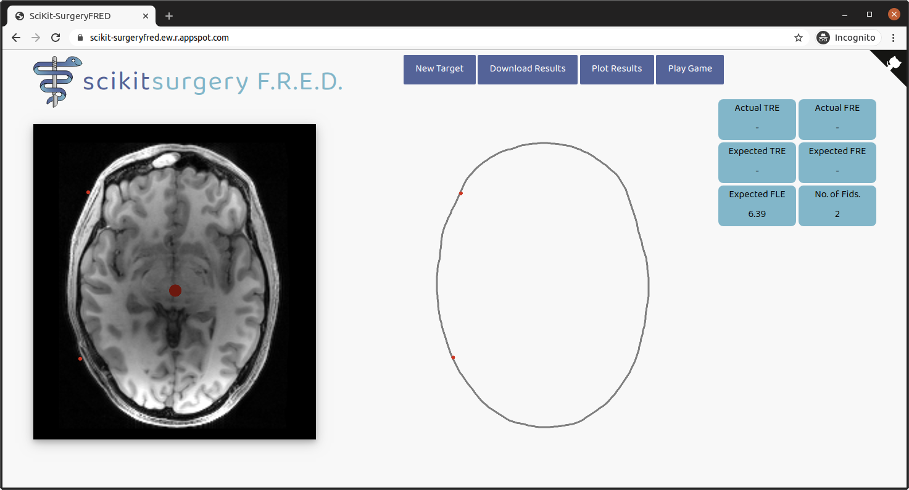
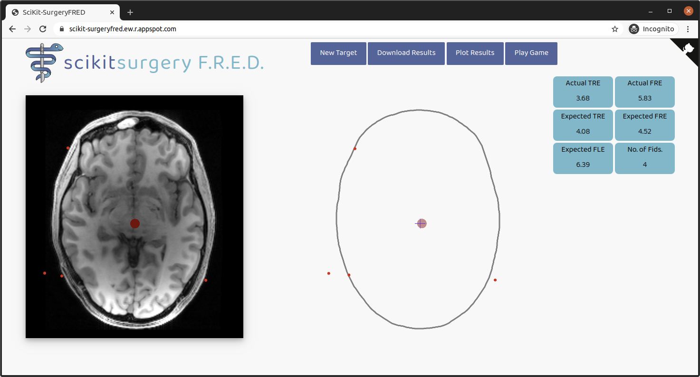

.. _FidRegistrationTutorial:

Fiducial Registration Tutorial
==============================

Introduction
------------

This is the `SciKit-Surgery`_ tutorial on fiducial marker based registration. 
It was developed as a two hour tutorial for online delivery during the 2020 
`Medical Image Computing Summer School`_ hosted by UCL, but should be more broadly useable.
The concepts taught are directly applicable to fiducial marker based registration
as applied to image guided interventions, and are more broadly applicable to 
other registration and calibrations where a good understanding of residual errors 
is required. 

The tutorial makes use of the Python application `SciKit-SurgeryFRED`_.
The tutorial is divided into four sections:

* Familiarisation with the software and the relevant statistics (45 minutes)
* Analysis of data generated in the first section (45 minutes)
* Playing a game using the software (10 minutes)
* Discussion and writing up results (20 minutes)

Learning Objectives
-------------------

After completing the tutorial students should be able to:

* Explain what is meant by the terms Fiducial Localisation Error (FLE), Target Registration Error (TRE) and Fiducial Registration Error (FRE)
* Be familiar with the derivation of statistics for the expected value of the TRE and FRE.
* Produce data showing how different statistics may be used to estimate the likely TRE for a single registration.
* Explain why FRE may be used to assess registration accuracy.
* Explain why FRE may not be a useful predictor of TRE.

Assumed Knowledge
-----------------

This tutorial assumes the student can access a working implementation of `SciKit-SurgeryFRED`_ at https://scikit-surgeryfred.ew.r.appspot.com/

If this is not possible it also possible to run SciKit-SurgeryFRED locally with the following commands

:: 

    git clone https://github.com/UCL/scikit-surgeryfred
    cd scikit-surgeryfred
    tox -e py37
    source .tox/py37/bin/activate
    python main.py

Related Tutorials
-----------------

This tutorial was designed to replace the point based registration session of the `SciKit-SurgeryBARD`_ tutorial, to enable remote delivery when the students do not have access to a suitable phantom or printer.

Part 1 Introduction to Registration with SciKit-SurgeryFRED
-----------------------------------------------------------

Start scikit-surgeryfred. Open a web browser and open https://scikit-surgeryfred.ew.r.appspot.com/

.. _fred_0:

  SciKit-SurgeryFRED opens a window with two scenes, on the left is the preoperative image (MRI) with a target point marked in red. On the right is the intra-operative scene where only the patient outline is visible. We will use fiducial based registration to locate the target point on the intraoperative scene.

You can watch the SciKit-SurgeryFRED video (Note, this uses an old version of FRED, however the concepts are identical):

.. raw:: html

  <iframe width="560" height="315" src="https://www.youtube.com/embed/t_6CH5uroYo" frameborder="0" allow="accelerometer; autoplay; encrypted-media; gyroscope; picture-in-picture" allowfullscreen></iframe>

On starting SciKit-SurgeryFRED you should see two images side by side as in the image above . The pre-operative image on
the left has a target identified in red. The idea is to locate the target on the intra-operative image on the right, where we can only see the patient's outline. Locating the target in the intra-operative image is done here using fiducial marker based registration. Mouse clicking on either image will place a fiducial marker at the same location (plus a randomly sampled fiducial localisation error) on each image, defining a point correspondence between the two images.

.. _fred_1:

  Clicking on either image places a fiducial marker (small red circle) defining a point correspondence between the images

.. _fred_1z:

  SciKit-SurgeryFRED adds a Fiducial Localisation Error to the marker in the intraoperative image. The zoomed in region shows the cross hair where the marker is in the pre-operative image, and the red circle where we have located it. The difference between the circle and cross hair centre is the FLE for this marker.

Point based registration requires at least three points to work. So keep adding marker points. At this point you may want to revisit the literature on point based registration, [Fitzpatrick1998]_, [Fitzpatrick2001]_, and  [Maurer1998]_ and consider where to place the fiducial markers to best effect. 

.. _fred_3:

  With 3 or more fiducial markers place, SciKit-SurgeryFRED is able to peform a point-based "Procrustes" registration between the two images. Note that the target is now present in the intraoperative image together with a cross hair. Similarly to the previous zoomed in image, the cross hair represents the actual position of the target, whereas the red circle is the estimated position using point based registration. The difference between the two centres is the Target Registration Error (TRE), in this case 3.68 mm ("Actual TRE").

You can add as many marker points as you like and see how the six measures (defined below) in the text boxes change. Placed markers cannot be deleted, but you can restart the registration with a new target by pressing the "New Target" button. 

What the text boxes mean
------------------------

SciKitSurgery-FRED has six text boxes that list six metrics, this is what they mean and how they should behave. Hovering 
over each box should also give a pop up box with more information.
Except for the number of fiducial markers the units are in pixels, so any physical interpretation will depend on the anatomy and size of the image, for example in the brain image used in the figures 1 pixel is approximately 0.7 mm. In any case the absolute magnitude of the values is not important for the tutorial, it is only the relationships between the metrics that we are interested in.

* "No. of Fids" is the number of fiducial markers placed, which should increase by one each time you click on the image.
* "Expected FLE" is the expected value of the squared Fiducial Localisation Error (equivalent to the variance or RMS squared). SciKit-SurgeryFRED models the FLE as a three dimensional isotropic normally distributed random variable. Each time a new registration is started the standard deviation of the FLE is randomly selected from a uniform distribution between 0.5 and 5.0. Each time a fiducial is placed, its position is perturbed in three dimensions by this standard deviation. The expected absolute value of an FLE with a given standard deviation is calculated and is shown here.  
* "Expected FRE" is the expected value of the squared Fiducial Registration Error (variance or RMS squared). This the expected absolute value of the Fiducial Registration Error as defined in equation 10 of [Fitzpatrick1998]_. The expected value of FRE is a function of the expected FLE and the number of fiducial markers. FRE should increase slightly as the number of fiducial markers increases.

.. _fred_fre:
.. figure:: registration_demo/fre_equation_10.png
  :width: 50%

* "Expected TRE" is the expected value of the squared target registration error (variance or RMS squared). This the expected absolute value of the target registration error as defined in equation 46 of [Fitzpatrick1998]_. The expected value of TRE is a function of the FLE and the number and geometry of the fiducial markers. Although it should reduce gradually as more fiducial markers are placed, it can be greatly altered by where you place the markers. Try this many times and see what happens to the expected TRE for different marker configurations.

.. _fred_tre:
.. figure:: registration_demo/tre_equation_46.png
  :width: 50%

* "Actual TRE", this is the actual measured Target Registration Error. It is the distance between the position of the target determined by registration and the actual position of the target. It is this value that will determine the effectiveness of an intervention, however in practice it cannot be known. It can only be measured in experiments where a second imaging modality is used or in the case of SciKit-SurgeryFRED, by simulation. The aim of this tutorial is to investigate which of the other statistics provide the best estimate of the actual TRE.

* "Actual FRE", this is the residual RMS distance between the registered point sets. It will largely depend on the FLE and the number of fiducial markers. Because it is easily measured it is often reported by commercial image guidance systems. However using the actual FRE as a measure of registration accuracy can be dangerous, as detailed succinctly in [Fitzpatrick2009]. More generally, the use of residual errors as a measure of accuracy (for registration and calibrations) is common in the literature, but is best avoided, for the same reasons.

Perform several registrations
-----------------------------

Now take around 20 minutes to perform multiple registrations. See what patterns of fiducial markers give low TREs and what patterns give high TREs. Observe how the statistics change as you add more fiducial markers. Each time a registration is performed SciKit-SurgeryiFRED will store the results in your browser, so do not refresh or restart your browser. You can 
download your results at any time by pressing the "Download Results" button. You can also plot them at any time by pressing the "Plot Results" button. Try and generate at least 200 registrations, the results of which will be used in the next section to look for correlations between the different statistics and the actual TRE.

Part 2 What Statistics are Useful in Predicting Actual TRE
----------------------------------------------------------

At the end of part 1 you should be able to download "results.csv", which you can open in analysis software of your choosing, as in the figure below. 

.. _results_csv:

results.cvs consists of a line for each successful registration.

There are 6 comma separated numbers. In order these are

::

    actual TRE, actual FRE, expected TRE, expected FRE, expected FLE, number of fiducial markers

You should be able to parse this data and investigate what if any correlations exist between the different data. For convenience SciKit-SurgeryFRED comes with a basic plotting tool, which you can use by pressing the "Plot Results" button, giving you something like the image below.

.. _fred_plots:

  Plots of the five statistics and their correlation with the Actual TRE.

However, we do not implement any tests for significance of any observed correlation, so you should try and perform a
suitable test. You can find the Python script we used in the `SciKit-SurgeryFRED paper`_ at https://doi.org/10.5281/zenodo.4434278

Take some time now to interrogate this data. Some questions to consider;

* Are your results similar to those in the chart above?
* If you were trying to estimate the actual target registration error, which statistic is of most use?
* What level of uncertainty would there be in an individual registration?
* What are the practical implications of using these statistics? For example, while the actual FRE and the number of fiducial markers can always be determined, the other statistics require a prior knowledge of the expected FLE.
* If your results are similar to mine, why is there no correlation between FRE and actual TRE?
* Are there conditions when you might expect to see correlation between FRE and TRE?
* If your results are similar to mine, why is there limited correlation between FLE and actual TRE?
* Are there conditions when you might expect to see more correlation between FLE and TRE?

Have a deeper dive through the data. What sort of probability distributions do the data fit? Are the assumptions used in our simulation valid in practice?

When you've looked at the data, you can have a go at part 3, where you'll try and apply what you've learned to some simulated surgery.

Part 3 Treatment Planning Simulation
------------------------------------

The last part of the tutorial is a game that highlights some of the issues that occur during image guided 
interventions. Here the image guided intervention has been simplified, your job is to place fiducial markers to
minimise target registration error, then use the knowledge you developed in parts 1 and 2 to adjust the ablation 
margin to maximise the treatment of the target and minimise damage to healthy tissue. Start by launching the game, by pressing the "Play Game" button. 

You can watch me playing the game in the video below (skip to 7 minutes and 25 seconds).

.. raw:: html
  <iframe width="560" height="315" src="https://www.youtube.com/embed/PaXytDjojOI?t=445" frameborder="0" allow="accelerometer; autoplay; encrypted-media; gyroscope; picture-in-picture" allowfullscreen></iframe>
    
The rules are:

* You are going to perform 10 image guided ablations. 
* You locate the target in the intraoperative image by placing up to 6 fiducial markers, using the same process as in part  1.
* You can change the treatment margin using the dial at the bottom left of the screen.
* When you think you have the right margin you perform the ablation by pressing the 'fire' button.
* You will be awarded a score. If you treat 100% of the target you start with 1000 points, anything less than 100% and you start with 0 points. Points are then subtracted based on the amount of healthy tissue ablated. A large margin will increase the chances of 100% ablation, but increase the amount of healthy tissue ablated.
* Throughout the game you will be shown different statistics to help you make your decision. 
* For the first 2 ablations you are shown the actual TRE (this is for training purposes, you could not 
  know this during an actual ablation). Knowing the TRE makes it easy to set the margin, the margin just needs to 
  be bigger than the TRE to ensure 100% treatment.
* You can then perform 8 more ablations, being shown different combinations of statistics that could be available 
  during an actual ablation. Your job is to use your knowledge of the predictive power of these statistics (gained 
  during part 1 and 2) to set the minimum effective margin. 
* Keep going until you get to the game over screen.

How did you do? Did you find it was easier to estimate a treatment margin for some statistics? Was there a link between the visible statistics and your scores? Does it correspond to the correlations you might have found in part 2?
Feel free to play the game multiple times and see if you can get into the hall of fame.

I would be grateful for any comments on the game or tutorial. You can `email me`_ or use the issue tracker on GitHub, `SciKit-SurgeryFRED`_.
 
.. _`SciKit-Surgery`: http:/scikit-surgery.org/
.. _`Medical Image Computing Summer School`: https://medicss.cs.ucl.ac.uk/
.. _`SciKit-SurgeryFRED`: https://github.com/UCL/scikit-surgeryfred
.. _`MPHY0026`: https://mphy0026.readthedocs.io/en/latest/
.. _`SciKit-SurgeryBARD`: https://scikit-surgerybard.readthedocs.io/en/latest/02_4_Register_And_Ovelay.html
.. _`email me`: s.thompson@ucl.ac.uk
.. _`Python setup`: https://mphy0026.readthedocs.io/en/latest/setup/setup.html
.. _`SciKit-SurgeryFRED paper`: https://discovery.ucl.ac.uk/id/eprint/10112339/7/Thompson_115980U.pdf
