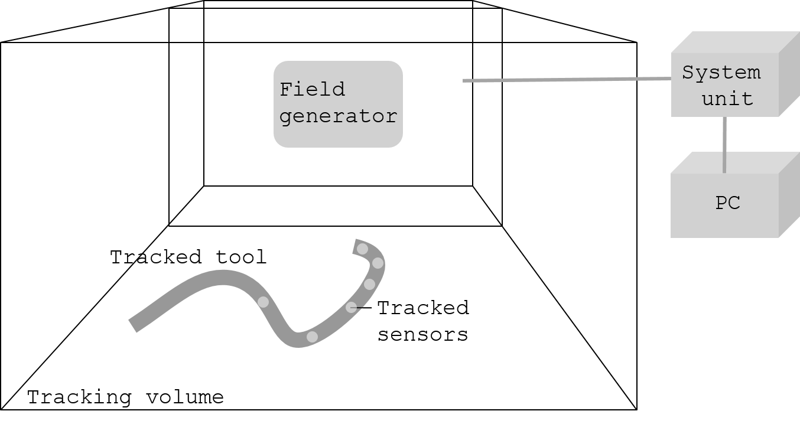
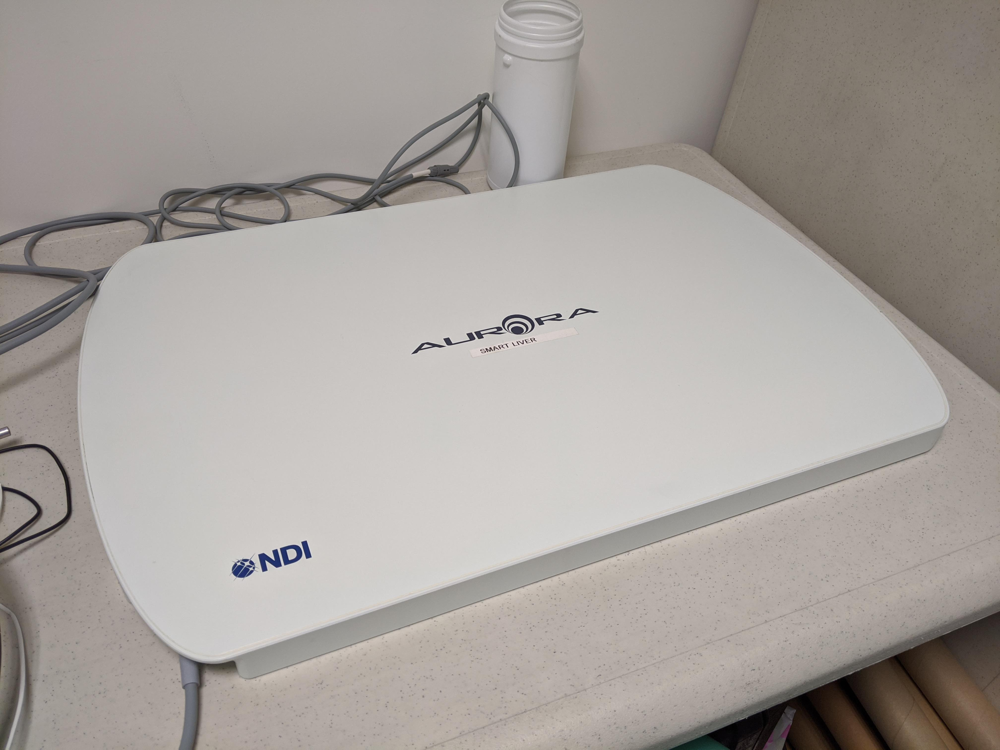
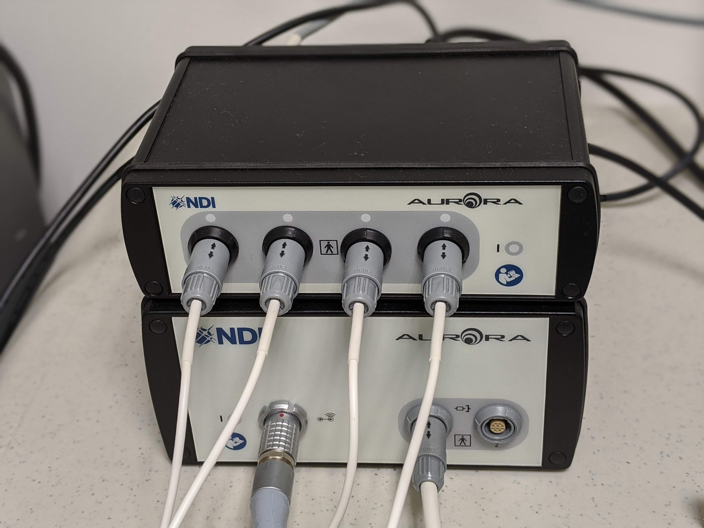
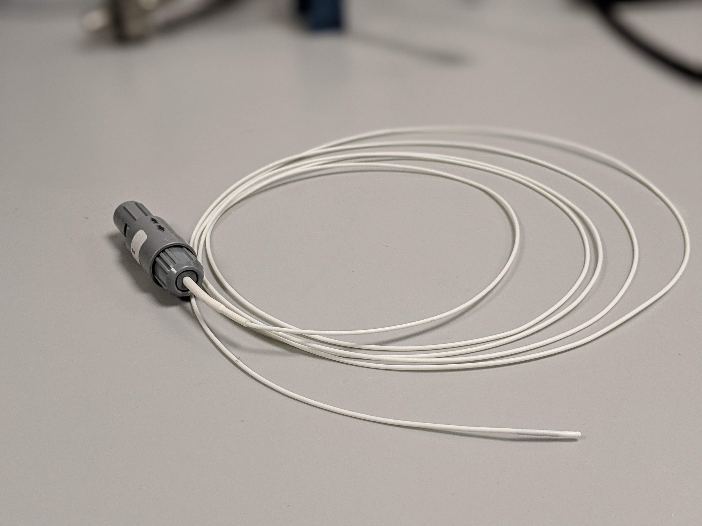

.. _EM:

Electromagnetic tracking
========================

Introduction
------------

Electromagnetic (EM) tracking systems track EMs moving within an EM field with known geometry created by a field generator. The electromagnetic field varies over time and position, therefore the sensors can measure the local field (6 DOFs). There is no need no maintain a lie-of-sight between the sensors and the field generator, which makes them very suitable to track instruments inside the body such as endoscopes and needles.
There are several types of EM tracking systems, which are described in the next sub sections.

AC-driven
^^^^^^^^^

First EM tracking systems used alternate current. These systems consist of several coils aligned in a specific geometry that emit the magnetic field. Small sensors (coils) measure the voltage from each coil and this is used to find the position of the sensor inside the EM field.  

DC-driven
^^^^^^^^^

DC-driven systems follow the same principle as AC-driven systems but they use direct current instead.

Passive systems
^^^^^^^^^^^^^^^

Passive systems track the position of permanent magnets. 

System components
-----------------

The system components of an electromagnetic tracking system are: 

* One field generator: Generates a magnetic field where the sensors can move and be tracked.
* A system unit which may be comprised of other units (e.g., sensor unit): Takes the readings from the sensors in the field and returns the 3D position.
* One or multiple sensors: Sensors will be attached to the tool that needs to be tracked and connected to the system unit (or sensor unit). They can be very small (0.3 mm).
* A computer: Takes the processed tracked data from the system unit in order to provide assistance to the surgical procedure.

The following picture show how the different components are connected.

  
  Main system components of an electromagnetic tracking system

And the following pictures show the components of a NDI Polaris Vicra optical tracking system:

  
  EM tracking system field generator. This NDI tabletop is medically useful because it can be placed under the patient and has a shield to avoid distortions from the patient's bed.

  
  EM tracking system unit (bottom) and sensor unit (top)
  

  
  EM tracking system sensor
  

  
Errors in electromagnetic tracking
----------------------------------

Metallic objects
^^^^^^^^^^^^^^^^
AC systems are prone to distortions when metallic objects such as stainless steel or aluminium are placed nearby (either to the field of to the sensor). 

Ferromagnetic materials
^^^^^^^^^^^^^^^^^^^^^^^
Materials such as nickel or iron can become magnetic when they are close to a magnetic field provoking a distortion on me generated field and in turn a distortion in the measurements.

Electronic devices
^^^^^^^^^^^^^^^^^^
Electronic devices or cables placed close to the EM equipment (less than 1 metre) can also distort the magnetic field.

Limitations
-----------
The main limitation of EM systems is the distortion of the field caused by nearby objects. To overcome this limitation, NDI started to commercialise an EM system with a tabletop as a field generator that has a shield to avoid distortions to the generated field from the patient bed.

Another limitation of these system is the size of the sensors and the cable required to connect them to the system unit.