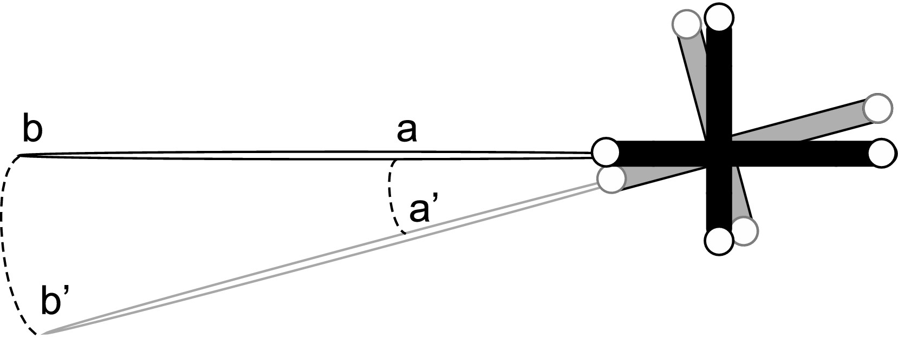
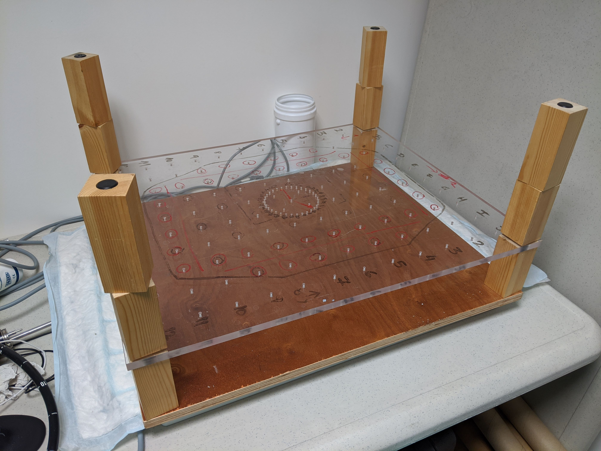

.. _ErrorsTracking:

Errors and accuracy
===================

All tracking systems suffer from positional and rotational errors. In the following subsections, the main tracking errors are described.
  
Lever-arm effect error
----------------------
Rotational errors can have a big impact on the performance of the optical tracking system due to the so-called lever-arm effect, especially when the tracked marker/sensor lies further away from the tip of the tool that is being tracked [West2004]_.
The lever-arm effect is the propagation of an error on the rotation measurement of the marker to the tool tip. 
The longer the distance between the marker and the tip of the tool, the larger the error may be.

  
  Lever-arm effect error by [Xiao2018]_, is licensed under `CC BY-SA 4.0`_.

Static errors
-------------

Static errors happen when the sensor/marker remains in a static position but the tracking readings differ slightly, and are commonly analysed in terms of accuracy and precision.
Precision refers to how close two or more measurements are closed to each other, while accuracy refers to how close the measurements are to the true (real) value. These two terms are shown in the Figure below:

.. figure:: accuracy_precision.png
  :alt: Difference between accuracy and precision
  :width: 600
  
  Difference between accuracy and precision

Several protocols have been proposed to study static errors: [Frantz2003]_ and [Wiles2004]_ among others.
These errors can be found by analysing the tracking data when the sensor/marker remain in a static position (do not move). There have been several studies regarding the analysis of static errors.
The most common protocol was proposed by Hummel et al. [Hummel2005]_, as several optical and electromagnetic tracking systems have been evaluated using this protocol: [Xiao2018]_, [Bonmati2017]_, [West2004]_, [Shahidi2002]_. 
The so-called Hummel protocol consists of a machined base plate (see Figure below) that allows to measure positional and rotational tracking data with high simplicity, reproducibility with a precise ground truth and accuracy.
Static errors are divided into jitter and accuracy.

  
  Hummel board.

Jitter (precision) 
^^^^^^^^^^^^^^^^^^

Repeated tracking measurements when the marker or sensor are in a static position contain random errors, commonly referred to as jitter.
Using the Hummel board, the sensor/marker, can be fixed into a specific position at different distances from the coordinates origin.
Then, for each position, 10-20 seconds of positional and rotational data are acquired.
The jitter can be found by calculating the Euclidean distance between the measured location and the mean location over all the samples. 
For each grid position, the precision is quantified by calculating the root-mean-square errors of positional and rotational distances.

Accuracy
^^^^^^^^

The tracking measurements when the sensor/marker moves from one static position to another static position may differ from reality.
To find the accuracy, the Hummel board can be used as a ground truth. For each position on the grid, 10-20 seconds of positional and rotational data are acquired. 
Then, for each position, we can find the mean measurement (position+rotation) and the distance to all of the other positions (or neighbours is found). 
The accuracy is calculated as the mean of the absolute difference between the ground-truth and the measured distance for each pair of positions.

Dynamic errors
--------------

Dynamic errors can be found by fixing the markers/sensors onto a fixed surface (rigid body) forming a triangle (or another geometrical shape) [Thompson2013]_, [Bonmati2017]_. Then the rigid body is moved within the field of view of the tracking system.
The differences in distance between the markers/sensors as they are moved is compared to the distances when the rigid body is in static position in order to find the dynamic error. The analysis can be done at different speeds.
Although this evaluation does not represent a complete analysis of the dynamic error, it gives a useful estimate.

