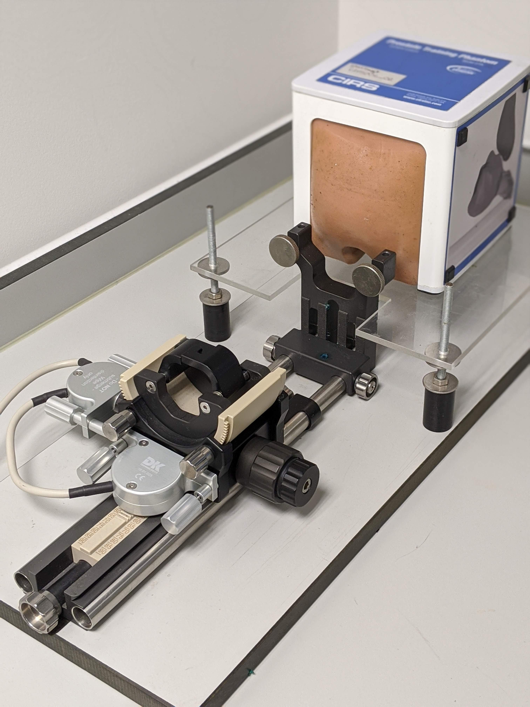

.. _IntroductionTracking:

Introduction
============

Tracking systems are fundamental for CAI as they allow us to track the position of a tool or device (e.g., laparoscope, endoscope, needle, ultrasound probe, video camera, ...) relative to the patient anatomy during a surgical procedure in 3D space and is a key enabling technology in CAI.

History
-------

* **1908**: A tracking system is used for the first time in humans. It is a mechanical sterotactic frame and is used for neurological applications. This frame has a 3-dimensional coordinate system and allows us to place instruments at a specific location by manually selecting the position of each coordinate [HorsleyClarke1908]_, [Heller2006]_. See :numref:`HorsleyClarkeStereotacticFrame`.
* **1960s**: The benefits and accuracy of the stereotactic device becomes a standard practice.
* **1980s**: Mechanical digitizers become popular due to their use in CAS, especially in neurosurgery. 
* **1990s**: Optical trackers are introduced in order to overcome clinical problems of previous tracking systems such as the ability to track multiple devices and sterilisation issues, evolving to very accurate devices. On of the main limitations of optical trackers is the line-of-sight requirement between the tracked markers and the camera.
* **Late 1990s, early 2000s**: The introduction of electromagnetic trackers allows to track devices without requiring a line-of-sight.

Types of tracking
-----------------

The most common tracking systems used in surgery can be grouped as follows:

* **Mechanical digitizers**: Transform a mechanical movement to a digital measurement. These digitizers are widely used in robotics, in order to move robot arms but also in other clinical applications such as prostate interventions (see picutre below):

  
  Example of a mechanical digitizer to hold an ultrasound probe for prostate interventions, with a prostate phantom.

* **Ultrasonic transducers**: Measures the time of an ultrasonic pulse from 3 sources into 3 microphones attached to a rigid body in order to calculate distances.

* **Optical tracking**: Most popular tracking used in surgical interventions. Several cameras track several markers in a fixed geometry. See next sections for more details.

* **Electromagnetic tracking**: Electromagnetically-tracked sensors can be tracked within an electromagnetic field. See next sections for more details.

* **Fiber-optic ultrasound**: Used in ultrasound interventions for research mainly. A fiber-optic ultrasound receiver communicates with a external ultrasound probe and allows to localise needles during ultrasound interventions.

.. raw:: html

    <iframe width="560" height="315" src="https://www.youtube.com/embed/GutD3Cc6LxA?start=2705" frameborder="0" allow="accelerometer; autoplay; encrypted-media; gyroscope; picture-in-picture" allowfullscreen></iframe>

* **Accelerometers and gyroscopes**: Measure acceleration and angular velocity to determine the position. Is the same system used in mobile phones. Ultrasound probes from Clarius employ this system to reconstruct 2D ultrasound planes to 3D models.

