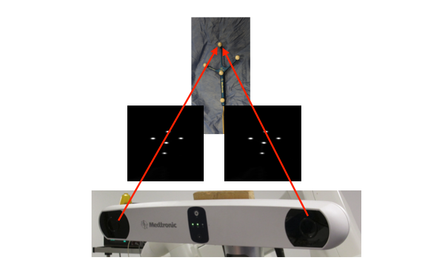
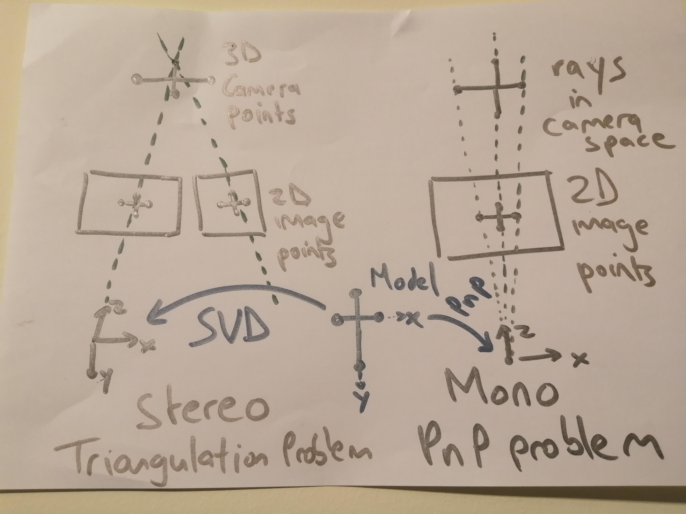
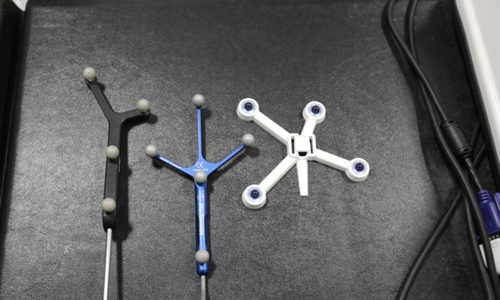

.. _Optical:

Optical tracking
================

Introduction
------------

Optical tracking involve the use of cameras (usually in a fixed position) to localise markers fixed in a rigid arrangement that are tracked in real-time. The tracked markers need to be in the line-of-sight of the camera.
This system is the most popular so far in surgical interventions mainly due to its accuracy and reliability (e.g. 0.25 mm accuracy with an NDI Polaris Spectra optical tracker), however, the required line-of-sight between cameras and markers make this technology not suitable for interventions where the object of interest is inside the human body (e.g., endoscope, catheter, etc.).

Types of systems
----------------

Optical tracking systems used in surgery can be divided in to main groups: video tracking and Infra-Red (IR) -based tracking. The following sections describe these types of optical tracking.

Video tracking systems
^^^^^^^^^^^^^^^^^^^^^^

Video tracking systems track a fiducial marker with a printed pattern on it (e.g., white/black squares) from video images taken from one or multiple calibrated cameras.

  
  ArUco marker, also called a 'tag'. Other tag libraries exist (AprilTags, ARTag etc).

In a tag based system, basic image processing can be used to identify the tag and
locate the 4 corners in the 2D image. The patterns are rotationally invariant,
which means the 4 corners can be uniquely identified. You can track
1 tag, via just its 4 corners, but it can more accurate to calculate
the middle of each tag by intersection of the tag's diagonals,
and use multiple tags. With N or more tag centres, or N 3D points, and
their corresponding 2D locations, a tracking transformation of the
markers relative to the camera coordinate system can be deduced via
the `Perspective N Point algorithm`_, for example `implemented in OpenCV`_.
Such systems can work with Mono cameras.

Take a look at the :ref:`SummerSchoolPivotCalibration` demonstration to
see this in action for yourself by making a tracked pointer!

An alternative, is something like the `Claron Microntracker`_, which
has a big market presence in dentistry.

.. raw:: html

    <iframe width="560" height="315" src="https://www.youtube.com/embed/2Mj7mgkvEbY" frameborder="0" allow="accelerometer; autoplay; encrypted-media; gyroscope; picture-in-picture" allowfullscreen></iframe>

The above video, from the ClaronTechnology channel on YouTube shows the use of Navident for dental surgery.

The Claron Microntracker tracks multiple non-unique markers. Each tool has an arrangement of 3 or more markers,
and the software can work out which tool is which, based on the unique arrangement of markers, use triangulation
to determine the 3D points, and then use point-based registration to compute the pose of the tracked tool relative to
the camera coordinate system. This is similar in principle to the IR trackers shown below.

Infra-red-based tracking systems
^^^^^^^^^^^^^^^^^^^^^^^^^^^^^^^^

Infra-red cameras are used as optical markers can be tracked easier due to the elimination of ambient light. The systems can be divided in two types:

* **Active optical trackers**: Markers (usually LEDs) emit infra-reds using different firing sequences that are activated by an electrical current (including wireless). The system has a central unit that detects the markers from each camera and employs triangulation in order to find the 3D location of each marker, and then matches to the known geometrical arrangement of each tool in the system to determine the pose of the tool relative to the tracking device.

* **Passive optical trackers**: Retro-reflective spheres are illuminated and detected by the infra-red cameras. The spheres are attached to a rigid body with a unique geometry for each tracked device.

  
  Example of two images acquired with two infra-red cameras of a tracked tool.
  

Mono Versus Stereo
^^^^^^^^^^^^^^^^^^

So, mono and stereo may look similar to the untrained eye. But put them side by
side and they are quite different.

* **Mono**: Projects rays, in camera space, through 2D points, into lines in camera space. The `Perspective N Point algorithm`_ is used to fit 3D model points, to 3D rays in camera space. At no point is the 3D location of the fiducials computed in camera space. The end result is the best fit of the marker coordinate system to the camera coordinate system.
* **Stereo**: Given 2 or more cameras, you calculate the 3D location in camera space of each fiducial. Then :ref:`PointBasedRegistration` is used to compute the rigid body transformation from the tracking marker (a.k.a. rigid body) coordinate system to the camera coordinate system.

  Side by side comparison of Mono and Stereo tracking methods.

So, both methods compute the transformation from the tracking marker coordinate system to the camera coordinate system.

System components
-----------------

The system components of an optical tracking system are: 

* One or multiple cameras: The camera capture range defines the tracking volume where the markers can move and be tracked.
* A system unit: The system units performs all the processing of the images captures by the camera and provides the 3D position of the markers.
* Markers: Will be fixed to the tools that need to be tracked. Each tool must have a uniquely identifiable marker.
* A computer: Takes the processed tracked data from the system unit in order to provide assistance to the surgical procedure.

The following picture show how the different components are connected.

.. figure:: infrared_tracking.png
  :alt: Main system components of an infra-red optical tracking system
  :width: 600
  
  Main system components of an infra-red optical tracking system

And the following pictures show the real components of a `NDI Polaris Vicra <https://www.ndigital.com/medical/products/polaris-family/>`_ optical tracking system:

.. figure:: optical_cameras.jpg
  :alt: Optical tracking system cameras
  :width: 600
  
  Optical tracking system cameras.
  
.. figure:: optical_system_unit.jpg
  :alt: Optical tracking system unit
  :width: 600
  
  Optical tracking system unit.

.. figure:: optical_rigid_body.jpg
  :alt: Rigid body with markers attached.
  :width: 600
  
  Rigid body with markers attached.
  

  
  Another example of rigid bodies with markers attached.

.. figure:: optical_IR_marker.jpg
  :alt: Optical tracking system IR markers.
  :width: 600
  
  Optical tracking system IR markers.

Errors of optical trackers
--------------------------

Similar to the human eye, 2 or more stereo cameras are used to image the markers, which are then detected from the images and matched from the left and right images. 
The 3D position of the markers is found by doing triangulation as the position of the two cameras is known.
By comparing the two images, and doing a triangulation the 3D position of the marker can be obtained. 
However depth calculation can have errors, due to the so-called disparity (difference between the same point projected on the two images).
Errors in disparity are inversely proportional to the depth, meaning that errors in disparity calculation will increase quadratically with the depth measurement from the camera.

Furthermore, tracking errors propagate from 2D errors in pixels from the tracking cameras to 3D positional errors through triangulation. 
This results in substantially anisotropic errors (errors normal to the camera lens are typically 3 times those parallel). 
There is also substantial variation over the tracking volume, resulting in most systems having a factory set tracking volume.

Limitations of optical trackers
-------------------------------
The main limitation of optical trackers is the requirement to keep a line-of-sight between cameras and markers. In an operating room, where multiple devices and several people are working and moving at the same time, it may be difficult to keep a line-of-sight at all times.
Optical tracking is usually not the best option to track flexible or small instruments (e.g., needles).

.. _`Perspective N Point algorithm`: https://en.wikipedia.org/wiki/Perspective-n-Point
.. _`implemented in OpenCV`: https://docs.opencv.org/2.4/modules/calib3d/doc/camera_calibration_and_3d_reconstruction.html#solvepnp
.. _`Claron Microntracker`: https://www.claronav.com/microntracker/