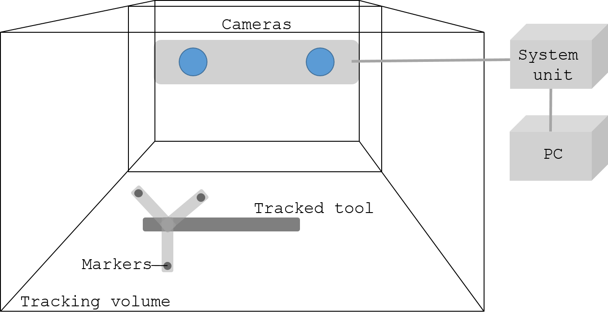
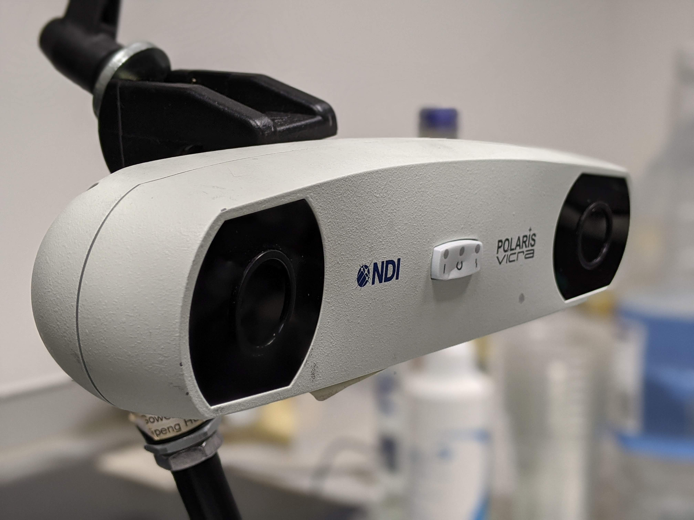
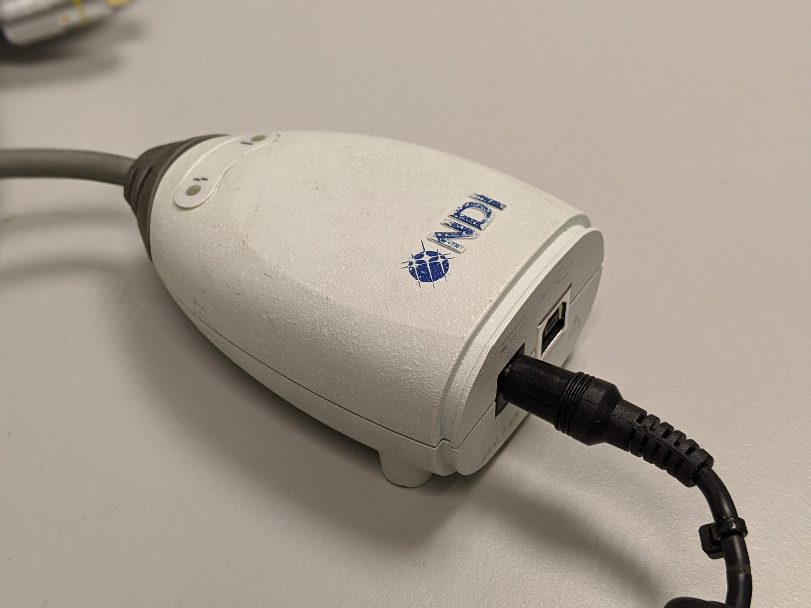
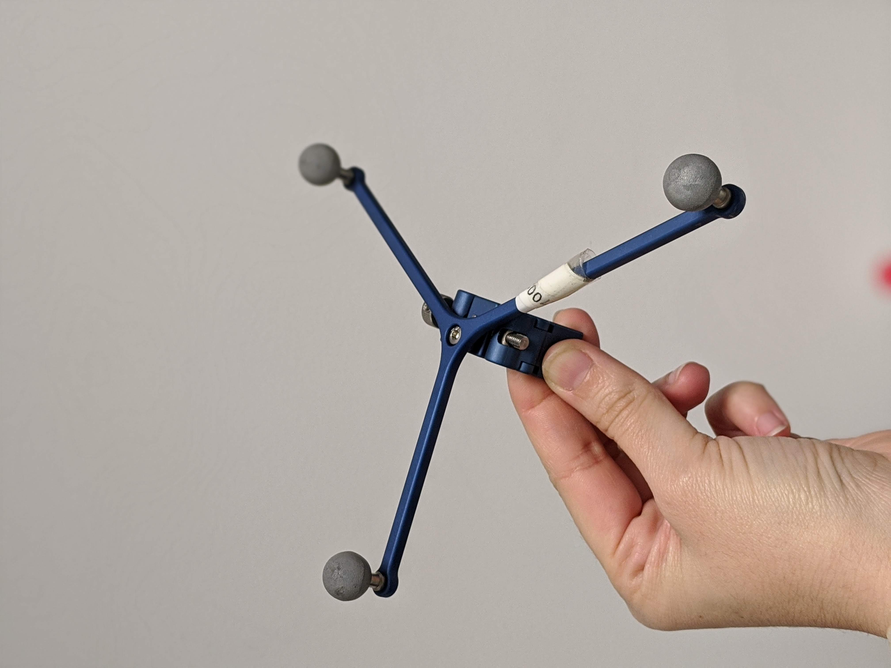
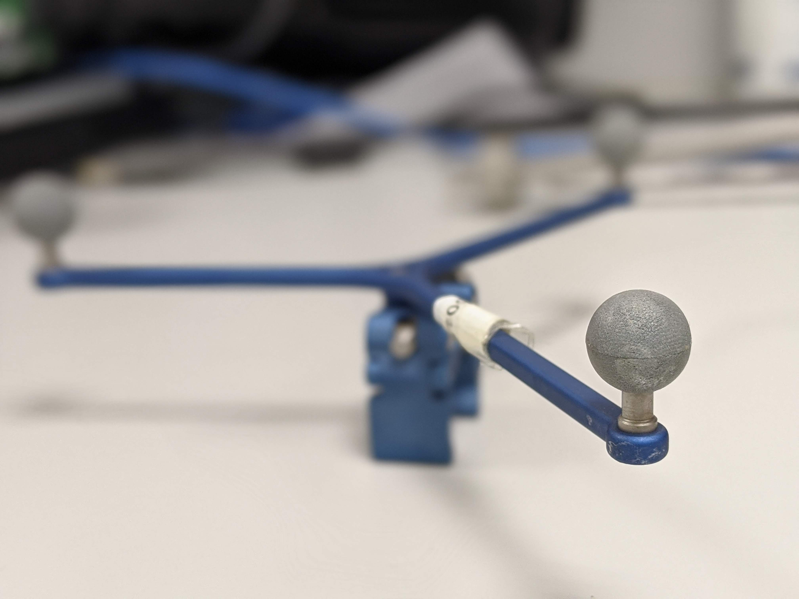

.. _Optical:

Optical tracking
================

Introduction
------------

Optical tracking involve the use of cameras (usually in a fixed position) to localise markers fixed in a rigid body shape (moving object) that is tracked in real-time. The cameras and tracked markers need to be in line-of-sight.
This system is the most popular so far in surgical interventions mainly due to its accuracy and reliability, however, the required line-of-sight between cameras and markers make this technology not adequate for  interventions where the object of interest is inside the human body (e.g., endoscope, catheter, etc.).

Types of systems
----------------

Optical tracking systems used in surgery can be divided in to main groups: video tracking and IR-based tracking. The following sections describe these types of optical tracking.

Video tracking systems
^^^^^^^^^^^^^^^^^^^^^^

Video tracking systems track a fiducial marker with a printed pattern on it (e.g., white/black squares) from video images taken from one or multiple calibrated cameras.

(TODO: Picture of markers here)

Infra-red-based tracking systems
^^^^^^^^^^^^^^^^^^^^^^^^^^^^^^^^

Infra-red cameras are used as optical markers can be tracked easier due to the elimination of ambient light. There systems can be divided in two types:

* **Active optical trackers**: Markers (usually LEDs) emit infra-reds using different firing sequences that are activated by an electrical current (including wireless). The system has a central unit that detects the markers from each camera and employs triangulation in order to find a 6 DOF position.

* **Passive optical trackers**: Retro-reflective spheres are illuminated and detected by the infra-red cameras. The spheres are attached to a rigid body with a unique geometry for each tracked device.

System components
-----------------

The system components of an optical tracking system are: 

* One or multiple cameras: The camera capture range defines the tracking volume where the markers can move and be tracked
* A system unit which may be comprised of other units (for infra-red-based systems only): The system units performs all the processing of the images captures by the camera and provides the 3D position of the markers.
* Markers: Will be fixed to the tools that need to be tracked. Each tool must have a different marker.
* A computer: Takes the processed tracked data from the system unit in order to provide assistance to the surgical procedure.

The following picture show how the different components are connected.

  
  Main system components of an infra-red optical tracking system

And the following pictures show the real components of a NDI Polaris Vicra optical tracking system:

  
  Optical tracking system cameras.
  

  
  Optical tracking system unit.
  

  
  Optical tracking system rigid body with markers attached.

  
  Optical tracking system IR markers.

Errors of optical trackers: depth reconstruction error
------------------------------------------------------

Similar to the human eye, 2 stereo cameras are used to image the markers, which are then detected from the images and matched from the left and right images. The 3D position of the markers is found by doing triangulation as the position of the two cameras is known.
By comparing the two images, and doing a triangulation the 3D position of the marker can be obtained. However depth calculation can have errors, due to the so-called disparity (difference between the same point projected on the two images).
Errors in disparity are inversely proportional to the depth, meaning that errors in disparity calculation will increase quadratically the depth measurement from the camera. 

Limitations of optical trackers
-------------------------------
The main limitation of optical trackers is the requirement to keep a line-of-sight between cameras and markers. In an operating room, where multiple devices and several people are working and moving at the same time, it may be difficult to keep a line-of-sight at all times.
Optical tracking is usually not the best option to track flexible or small instruments (e.g., needles).
